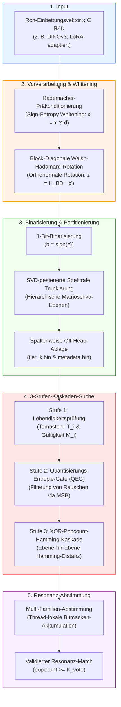

---

## Übersicht: Die Pithos-Verarbeitungs-Pipeline



---

## 1. Input: Roh-Einbettungsvektoren

Wir beginnen mit einem hochdimensionalen, kontinuierlichen Einbettungsvektor:

> [!abstract] Mathematische Darstellung des Inputs
> - **Rohvektor:** $x \in \mathbb{R}^D$ aus einem Einbettungsmodell (z. B. DINOv3 oder LoRA-adaptierte Repräsentationen).
> - **Eigenschaft:** Der Vektor repräsentiert einen Punkt in einem hochdimensionalen Raum, in dem Winkeldistanzen (Cosine Similarity) semantische Ähnlichkeiten abbilden.

> [!warning] Problemstellung
> Die direkte Verarbeitung von Roh-Einbettungen bringt signifikante Nachteile im planetaren oder ressourcenbeschränkten Einsatz mit sich:
> 1. **Speicherintensiv:** Jeder Vektor benötigt $D \times 4\text{ Bytes}$ Speicherplatz bei einfacher Genauigkeit (FP32).
> 2. **Rechenaufwendig:** Ähnlichkeitssuchen (Nearest-Neighbor-Suche) im großen Maßstab erfordern teure Gleitkomma-Vektoroperationen.
> 3. **Hardware-Inkompatibilität:** Kontinuierliche Fließkomma-Arithmetik ist ungeeignet für extrem schnelle Binäroperationen oder direkte Hardware-Beschleunigung auf FPGA/ASIC-Ebene.

> [!success] Lösung: Pithos-Ansatz
> Transformation von $x$ in eine ultrakompakte, binäre Darstellung unter strikter Erhaltung der zugrundeliegenden Winkeldistanz-Geometrie des Originalraumes.

---

## 2. Schritt 1: Rademacher-Präkonditionierung (Whitening)

Um Signal-Entropie-Lecks zu verhindern und die Kovarianz der einzelnen Koordinaten zu dekorrelieren ("Whitening"), wenden wir eine Vorzeichen-Präkonditionierung an.

> [!info] Definition
> Sei $D_{\text{pre}} = \text{diag}(d_1, d_2, \dots, d_D)$ eine Diagonalmatrix, bei der jedes Diagonalelement $d_j \in \{-1, 1\}$ eine unabhängige Rademacher-Zufallsvariable darstellt:
> $$P(d_j = 1) = P(d_j = -1) = 0.5$$

> [!math] Transformation
> Der präkonditionierte Vektor $x' \in \mathbb{R}^D$ wird über das Hadamard-Produkt (elementweise Multiplikation) berechnet:
> $$x' = x \odot d$$
> Wobei $d = [d_1, d_2, \dots, d_D]^T$ der aus den Diagonalelementen gebildete Vorzeichenvektor ist.

> [!note] Mathematischer Zweck
> - **Whitening:** Die Eingangsverteilung wird durch das zufällige Umkehren von Vorzeichen gleichmäßig über den Raum verteilt, was Informationslecks an einzelnen Koordinatenachsen schließt.
> - **Erhaltung der Winkeldistanz:** Für beliebige Vektoren $x_1, x_2$ bleibt das Skalarprodukt und damit die Cosine Similarity exakt erhalten:
>   $$\cos\theta(x_1', x_2') = \frac{x_1' \cdot x_2'}{\|x_1'\| \|x_2'\|} = \frac{(x_1 \odot d) \cdot (x_2 \odot d)}{\|x_1\| \|x_2\|} = \cos\theta(x_1, x_2)$$
> - Dies verhindert effektiv eine dominante Koordinatenkovarianz, welche die Geometrie der Einbettung verzerren würde.

---

## 3. Schritt 2: Block-Diagonale Walsh-Hadamard-Rotation

Als Nächstes wenden wir eine strukturierte, orthogonale Rotation an. Dies sorgt für eine maximale Informationsverteilung über alle Dimensionen, ohne die Distanzrelationen zu manipulieren.

> [!info] Definition
> Die block-diagonale Walsh-Hadamard-Matrix $H_{\text{BD}} \in \mathbb{R}^{D \times D}$ ist definiert als die direkte Summe kleinerer Hadamard-Blöcke:
> $$H_{\text{BD}} = \bigoplus_{k=1}^T H_{\Delta s_k}$$
> Wobei:
> - $\Delta s_k = s_k - s_{k-1}$ die Breite der $k$-ten Matrjoschka-Ebene (hierarchische Partition der Gesamtdimension $D$) beschreibt.
> - $H_{\Delta s_k}$ eine Sylvester-Hadamard-Matrix der Dimension $\Delta s_k \times \Delta s_k$ ist, normalisiert mit $\frac{1}{\sqrt{\Delta s_k}}$, um die Orthonormalität zu garantieren.

> [!math] Rekursive Konstruktion der Sylvester-Hadamard-Matrizen
> Für Dimensionen mit Zweierpotenzen ($m \ge 1$):
> $$H_{2^m} = \frac{1}{\sqrt{2}} \begin{bmatrix} H_{2^{m-1}} & H_{2^{m-1}} \\ H_{2^{m-1}} & -H_{2^{m-1}} \end{bmatrix}, \quad H_1 = [1]$$
> 
> **Kronecker-Fallback für Nicht-Zweierpotenz-Dimensionen:**
> Falls ein Block $\Delta s_k$ keine glatte Zweierpotenz ist, zerlegen wir ihn in $\Delta s_k = u \times v$, wobei $u = 2^m$ die größte Zweierpotenz mit $u \le \Delta s_k$ darstellt. Die Transformation erfolgt dann über:
> $$H_{\Delta s_k} = H_u \otimes \Omega_v$$
> Wobei $\otimes$ für das Kronecker-Produkt steht und $\Omega_v \in \mathbb{R}^{v \times v}$ die Orthonormalbasis einer Diskreten Kosinustransformation (DCT-II) repräsentiert:
> $$\Omega_v(p, q) = \sqrt{\frac{2 - \delta_{p,0}}{v}} \cos\left( \frac{\pi (2q + 1) p}{2v} \right), \quad p, q \in \{0, \dots, v-1\}$$
> ($\delta_{p,0}$ bezeichnet das klassische Kronecker-Delta).

> [!math] Transformation
> Der rotierte, kontinuierliche Vektor $z \in \mathbb{R}^D$ ergibt sich aus:
> $$z = H_{\text{BD}} x'$$

> [!note] Zweck der Rotation
> - **Erhaltung der Distanzen:** Da $H_{\text{BD}}$ eine orthogonale Matrix ist ($H_{\text{BD}}^T H_{\text{BD}} = I$), bleibt die Euklidische Distanz perfekt erhalten:
>   $$\|z_1 - z_2\|_2 = \|x_1' - x_2'\|_2$$
> - **Binarisierungsvorbereitung:** Durch die Rotation wird die geometrische Energie gleichmäßig über alle Achsen verschmiert (Entropiemaximierung). Der Einbettungsvektor wird somit optimal am Binär-Hyperwürfel ausgerichtet.

---

## 4. Schritt 3: 1-Bit-Binarisierung

Hier erfolgt der entscheidende Schritt zur extremen Kompression des kontinuierlichen Raumes in den Hamming-Raum.

> [!info] Definition
> Der binarisierte Vektor $b \in \{0, 1\}^D$ wird über die Vorzeichenfunktion (`sign`) bestimmt:
> $$b = \text{sign}(z) = \begin{cases} 1 & \text{falls } z_j \ge 0 \\ 0 & \text{sonst} \end{cases}$$
> Die Operation wird strikt elementweise auf alle Koordinaten angewendet.

> [!note] Vorteile & Mathematische Verbindung
> - **Extreme Kompression:** Der Speicherbedarf schrumpft von $4D\text{ Bytes}$ (FP32) auf magere $\frac{D}{8}\text{ Bytes}$ (1 Bit pro Dimension). Dies entspricht einem Kompressionsfaktor von exakt **32x**.
> - **Hamming-Approximation der Winkeldistanz:** Nach dem Theorem von Grothendieck und der Theorie des *Locality Sensitive Hashing (LSH)* approximiert die normierte Hamming-Distanz zweier Binärvektoren die originale Winkeldistanz des kontinuierlichen Raumes:
>   $$\text{Hamming}(b_1, b_2) \approx \frac{D}{2} \left(1 - \frac{2}{\pi} \theta(z_1, z_2)\right)$$
>   Damit lässt sich die semantische Ähnlichkeit direkt über extrem schnelle Bitwise-XOR und Popcount-Befehle berechnen.

---

## 5. Schritt 4: SVD-gesteuerte Spektrale Trunkierung (Matrjoschka-Ebenen)

Um die Suche adaptiv zu gestalten, wird der binäre Vektor in hierarchisch geschachtelte Segmente (Matrjoschka-Ebenen) unterteilt. Die Grenzen dieser Segmente werden mathematisch exakt über die spektrale Energie einer Adapter-Matrix bestimmt.

> [!info] Input
> - Die eingefrorene Adapter-Gewichtsmatrix $W \in \mathbb{R}^{D \times r}$ des zugrundeliegenden Transformations- oder Projektionsmodells (z. B. LoRA-Gewichte).

### Schritt 4.1: Berechnung der Singulärwerte
Wir analysieren das Signalspektrum von $W$ mittels einer Jacobi-Singulärwertzerlegung (SVD):
1. Konstruktion der symmetrischen Kovarianzmatrix:
   $$C = W^T W \in \mathbb{R}^{r \times r}$$
2. Diagonalisierung von $C$ mittels iterativer Jacobi-Rotationsmatrizen zur Bestimmung der Eigenwerte $\lambda_1, \dots, \lambda_r$.
3. Die Singulärwerte von $W$ berechnen sich aus den Quadratwurzeln der Eigenwerte:
   $$\sigma_i = \sqrt{\lambda_i} \quad (\text{für } i \le r), \quad \sigma_i = 0 \quad (\text{für } i > r)$$
   wobei die Sortierung strikt absteigend erfolgt: $\sigma_1 \ge \sigma_2 \ge \dots \ge \sigma_D$.

### Schritt 4.2: Kumulative spektrale Energie
Die kumulative spektrale Energie $\Phi(k)$ bis zur Dimension $k$ misst den Anteil der mathematischen Varianz (Information), die in den ersten $k$ Dimensionen erhalten bleibt:
$$\Phi(k) = \frac{\sum_{i=1}^k \sigma_i^2}{\sum_{j=1}^{\min(D, r)} \sigma_j^2}$$

### Schritt 4.3: Auswahl der Ebenengrenzen
Gegeben sei ein anwendungsspezifisches Informationsbudget $\tau \in (0, 1]$. Wir bestimmen die minimale Dimension $k$, an der die kumulierte Energie die Schwelle $\tau$ überschreitet. Dieses $k$ definiert unsere aktive Ebenengrenze $\mathcal{T}(S, \tau)$:
$$\mathcal{T}(S, \tau) = \min \left\{ k \in \{1, \dots, D\} \;\middle|\; \Phi(k) \ge \tau \right\}$$

### Schritt 4.4: Ebenenpartitionierung
Der binäre Gesamtvektor $b$ wird anhand dieser Schwellenwerte in hierarchische Teilvektoren zerlegt:
$$b = \left[ b^{(0)}, b^{(1)}, \dots, b^{(T)} \right]$$
- **Ebene 0 (Kernschicht):** Beinhaltet die ersten $s_0 = \mathcal{T}(S, \tau_0)$ Bits (die signifikantesten Dimensionen mit der höchsten spektralen Energie).
- **Ebene k:** Beinhaltet die darauffolgenden Bits von Index $s_{k-1}$ bis $s_k$, wobei $s_k = \mathcal{T}(S, \tau_k)$ für eine aufsteigende Sequenz von Informationsbudgets $\tau_0 < \tau_1 < \dots < \tau_T$ definiert ist.

---

## 6. Schritt 5: Speichereffiziente spaltenweise Ablage

Um maximalen Datendurchsatz bei der Suche zu garantieren, werden die binarisierten Teilvektoren spaltenorientiert im physischen Speicher abgelegt.

> [!settings] Off-Heap Speicherlayout
> - **Dateiaufteilung:** Jede Matrjoschka-Ebene $k$ wird in einer eigenständigen Binärdatei `tier_k.bin` abgelegt.
> - **Index-basiert:** Es werden keine expliziten Primärschlüssel (IDs) gespeichert. Der Zeilenindex $i$ dient als implizite, globale Kennung.
> - **Adressberechnung für Direktauslese:**
>   Die exakte Byte-Adresse des Datensatzes $i$ in der Ebene $k$ berechnet sich deterministisch über:
>   $$\text{Addr}(i, k) = \text{Base}_k + i \cdot \frac{\Delta s_k}{8}$$
>   Wobei $\text{Base}_k$ der Startzeiger (Memory-Mapped Pointer) der Ebene $k$ ist und $\Delta s_k = s_k - s_{k-1}$ die Bitbreite dieser Ebene darstellt.
> - **Metadaten-Verwaltung:** Tombstone-Bits ($T_i$, zur logischen Löschung) und Gültigkeitsmasken ($M_i$) liegen kompakt gepackt in `metadata.bin` (Speicherbedarf: exakt $8\text{ Bytes}$ pro Eintrag $i$).

> [!tip] Vorteile des Layouts
> - **Zero-Copy Memory Mapping:** Durch den Verzicht auf Serialisierungs-Overhead können die Dateien via `mmap` direkt off-heap in den Adressraum geladen werden.
> - **DMA- & Cache-Freundlich:** Da die Vektoren einer Ebene lückenlos hintereinanderliegen, können moderne CPUs prefetching nutzen. Hardware-Beschleuniger (FPGAs/GPUs) greifen via DMA (Direct Memory Access) mit maximaler Bandbreite zu.

---

## 7. Schritt 6: Drei-Stufen-Kaskaden-Lesepfad

Während einer Suchanfrage durchläuft jeder Kandidatenvektor eine dreistufige Filterkaskade, um unnötige Lesezugriffe auf tiefere, speicherintensive Matrjoschka-Ebenen zu verhindern.

> [!quote] Die Kaskaden-Filterstufen
>
> ```
> [Kandidaten-Index i]
>         │
>         ▼
> ┌────────────────────────────────────────────────────────┐
> │              Stufe 1: Liveness-Check                   │ (Prüft Metadaten-Bits)
> └───────────────────────────┬────────────────────────────┘
>                             │ (Falls gültig)
>                             ▼
> ┌────────────────────────────────────────────────────────┐
> │         Stufe 2: Quantisierungs-Entropie-Gate (QEG)    │ (Analysiert MSB der Ebene 0)
> └───────────────────────────┬────────────────────────────┘
>                             │ (Falls hohe Entropie)
>                             ▼
> ┌────────────────────────────────────────────────────────┐
> │         Stufe 3: XOR-Popcount-Hamming-Kaskade          │ (Progressiver Distanz-Abbruch)
> └───────────────────────────┬────────────────────────────┘
>                             │ (Falls Distanz <= Schwelle)
>                             ▼
>                       [Treffer-Match]
> ```

#### Stufe 1: Lebendigkeitsprüfung (Liveness-Check)
Ein Eintrag $i$ wird sofort übersprungen, wenn das zugehörige Tombstone-Bit oder die Gültigkeitsmaske signalisiert, dass der Datensatz gelöscht oder ungültig ist:
$$\text{Skip, falls } T_i = 1 \quad \text{oder} \quad M_i = 0$$

#### Stufe 2: Quantisierungs-Entropie-Gate (QEG)
Frühzeitiger Abbruch bei Informationsarmut. Wir prüfen das signifikanteste Bit (Most Significant Bit, MSB) des ersten 64-Bit-Worts $t_i^{(0)}$ aus der Basisebene 0:
$$\text{Skip, falls } \text{MSB}\left(t_i^{(0)}\right) = 0$$
- **Hintergrund:** Ein führendes Null-Bit in dieser hochgradig spektral verdichteten Koordinate indiziert strukturloses Rauschen ("flaches Gelände"). Solche Datensätze weisen eine mathematisch unzureichende Entropie auf und können mit extrem hoher Wahrscheinlichkeit kein relevanter Match für komplexe Suchabfragen sein.

#### Stufe 3: XOR-Popcount-Hamming-Kaskade
Berechnung der Hamming-Distanz Ebene für Ebene. Wir addieren die partielle Distanz schrittweise auf:
$$\mathcal{D}_H^{(k)}(b_i, b(q)) = \sum_{d=1}^{s_k} b_{i,d} \oplus b_{q,d}$$
Wir brechen die Evaluation ab und lesen keine weiteren Tiers von der Festplatte/aus dem Speicher, sobald die partielle Hamming-Distanz die definierte Abfrageschwelle $T_q$ reißt:
$$\text{Abbruch, falls } \mathcal{D}_H^{(k)}(b_i, b(q)) > T_q$$

---

## 8. Schritt 7: Multi-Familien-Resonanzabstimmung

Für komplexe, planetare Anomalieanalysen verwendet Pithos ein hocheffizientes, sperrfreies (lock-free) Abstimmungsverfahren über verschiedene Abfragefamilien hinweg.

> [!settings] Ablauf der Resonanzabstimmung
> Gegeben sei eine Menge von simultanen Abfragen $Q = \{q_1, \dots, q_M\}$, wobei jede Abfrage einer Familie $f_j \in \{0, \dots, F-1\}$ zugeordnet ist und eine individuelle Hamming-Distanzschwelle $T_j$ besitzt.
> 
> **Schritt 7.1: Thread-lokale Abstimmung**
> Jeder Worker-Thread $w$ prozessiert eine Untermenge an Daten und baut für jeden geprüften Datensatz $i$ eine thread-lokale Bitmaske $V_{i,w}$ auf:
> $$V_{i,w} = \bigvee_{j=1}^M \mathbb{I}\left( \mathcal{D}_H^{(T)}(b_i, b(q_j)) \le T_j \right) \cdot 2^{f_j}$$
> Wobei $\mathbb{I}(\cdot)$ die mathematische Indikatorfunktion ist (liefert 1 bei Wahrheit, ansonsten 0) und $\bigvee$ für das bitweise ODER steht. Jede Familie setzt somit ein spezifisches Bit in der Maske.
> 
> **Schritt 7.2: Zusammenführen der Stimmen (Merge)**
> Da die Worker völlig unabhängig operieren, werden die Masken am Ende über eine atomare ODER-Reduktion zusammengeführt:
> $$V_i^{\text{merged}} = \bigvee_{w=1}^{N_{\text{workers}}} V_{i,w}$$
> 
> **Schritt 7.3: Resonanz-Entscheidung**
> Ein Datensatz $i$ gilt genau dann als valider "Resonanz-Match" für die Anomalie, wenn er eine kritische Anzahl unterschiedlicher Abfragefamilien aktiviert hat:
> $$\text{popcount}\left(V_i^{\text{merged}}\right) \ge K_{\text{vote}}$$
> Wobei die hardwarenahe Funktion `popcount` die Anzahl der gesetzten Bits in der vereinigten Maske zählt und $K_{\text{vote}}$ der globale Abstimmungsschwellenwert ist (z. B. $K_{\text{vote}} = 5$ bei $F = 8$ Gesamtfamilien).

---

## 9. Mathematische Garantien

Die Pithos-Architektur stützt sich auf drei fundamentale mathematische Säulen:

> [!check] Die drei Pithos-Garantien
> 
> ### 1. Metrische Zustandserhaltung (Distance Preservation)
> Durch die Kombination aus Rademacher-Präkonditionierung und der block-diagonalen Walsh-Hadamard-Rotation (beides orthonormale Transformationen im reellen Raum) bleibt die Winkelgeometrie unverzerrt:
> $$\cos\theta(x_1, x_2) = \cos\theta(x_1', x_2') = \cos\theta(z_1, z_2)$$
> Die nachfolgende 1-Bit-Quantisierung garantiert über die LSH-Metrik eine monotone, erwartungstreue Abbildung der originalen Ähnlichkeit im Hamming-Raum.
> 
> ### 2. F1-optimale spektrale Trunkierung
> Die über die SVD-Energiekurve $\Phi(k)$ hergeleiteten Ebenengrenzen $\mathcal{T}(S, \tau)$ sind nachweislich **F1-optimal** unter Ressourcenbeschränkung:
> - Sie maximieren den Recall (Auffindungsrate) bei der Suche für ein fest vorgegebenes Speicher- und I/O-Budget $\tau$.
> - Sie minimieren die durchschnittlich gelesene Datenmenge pro Abfrage bei einer geforderten Mindestgenauigkeit.
> 
> ### 3. Deterministische Konsistenz der Abstimmung
> Da die Multi-Familien-Resonanzabstimmung über ein kommutatives und assoziatives bitweises ODER-Schema zusammengeführt wird, ist das Endergebnis absolut unbeeinflusst von Race-Conditions, der Thread-Anzahl oder CPU-Scheduling-Effekten:
> $$\text{Gleicher Input } (Q, b) \implies \text{Exakt gleiches Suchergebnis } (Match)$$
> Dies reduziert statistisches Rauschen und eliminiert False Positives in rauen, verrauschten Messumgebungen.
