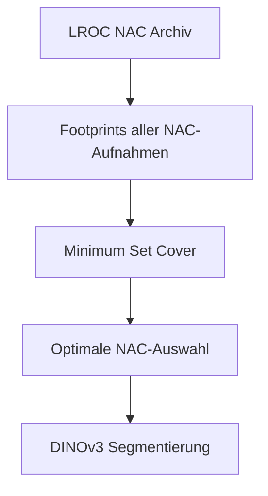
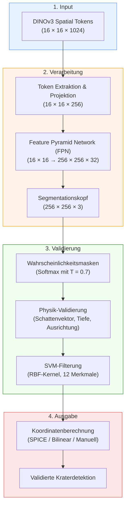

---

## Übersicht: Die vollständige Verarbeitungs-Pipeline

```mermaid
graph TD
	A0["LROC NAC Archiv"]
A1["Footprint-Berechnung"]
A2["Minimum Set Cover"]
A3["Optimale NAC-Auswahl"]

A0 --> A1
A1 --> A2
A2 --> A3
A3 --> A["DINOv3 Spatial Tokens<br/>(16 × 16 × 1024)"]
    A["DINOv3 Spatial Tokens<br/>(16 × 16 × 1024)"] --> B["Token Extraktion & Reshape<br/>(16 × 16 × 1024)"]
    B --> C["Lineare Projektion<br/>(16 × 16 × 256)"]

    subgraph FPN["Feature Pyramid Network (FPN)"]
        C --> D0["Ebene 0: Upsampling & Conv<br/>(32 × 32 × 256)"]
        D0 --> D1["Ebene 1: Upsampling & Conv<br/>(64 × 64 × 128)"]
        D1 --> D2["Ebene 2: Upsampling & Conv<br/>(128 × 128 × 64)"]
        D2 --> D3["Ebene 3: Upsampling & Conv<br/>(256 × 256 × 32)"]
    end

    D3 --> E["Segmentationskopf (3 Klassen)<br/>(256 × 256 × 3)"]
    E --> F["Softmax & Temperatur-Skalierung<br/>(T = 0.7)"]

    subgraph Phys["Physik-basierte Validierung"]
        F --> G1["Schwerpunkte & Schattenvektor<br/>atan2(Δy, Δx)"]
        G1 --> G2["Sonnenvektor-Abgleich<br/>(α + 90°) mod 360°"]
        G2 --> G3["Ausrichtungsfehler-Prüfung<br/>min(|Δθ|, 360° - |Δθ|)"]
        G3 --> G4["Trigonometrische Tiefenschätzung<br/>depth = L_m / tan(θ)"]
    end

    subgraph SVM["SVM-Klassifizierung"]
        G4 --> H1["Extraktion von 12 Merkmalen"]
        H1 --> H2["StandardScaler (Normalisierung)"]
        H2 --> H3["RBF-SVM (Klassen-Klassifizierung)"]
    end

    H3 --> I["Koordinatenberechnung<br/>(SPICE / Bilinear / Fallback)"]
    I --> J["Validierte Kraterdetektion"]

    %% Styling for Obsidian
    style A fill:#f9f,stroke:#333,stroke-width:2px
    style J fill:#bbf,stroke:#333,stroke-width:2px
    style FPN fill:#e6ffe6,stroke:#333,stroke-width:1px
    style Phys fill:#ffffe0,stroke:#333,stroke-width:1px
    style SVM fill:#ffe6e6,stroke:#333,stroke-width:1px
```




---

# 0. Optimale Auswahl der NAC-Kacheln (Minimum Set Cover)

Vor der eigentlichen Bildverarbeitung muss bestimmt werden, **welche LROC Narrow Angle Camera (NAC)-Aufnahmen überhaupt verarbeitet werden sollen**.

Da sich die einzelnen NAC-Aufnahmen stark überlappen, würde die Verarbeitung sämtlicher Bilder enorme Redundanz verursachen. Ziel ist daher die Auswahl einer möglichst kleinen Bildmenge, welche die gewünschte Mondoberfläche vollständig abdeckt.

Dieses Optimierungsproblem lässt sich als **Minimum Set Cover Problem** formulieren.

> [!abstract] Problemdefinition

Sei

$$
U=\{t_1,t_2,\ldots,t_n\}
$$

die Menge aller abzudeckenden Oberflächenelemente (z.B. Equal-Area-Gitterzellen oder LOLA-Kacheln).

Jede NAC-Aufnahme bildet eine Teilmenge

$$
S_i\subseteq U
$$

ab.

Gesucht wird eine minimale Teilmenge

$$
\mathcal C\subseteq\{S_1,\ldots,S_m\}
$$

mit

$$
\bigcup_{S_i\in\mathcal C}S_i=U
$$

wobei

$$
|\mathcal C|
$$

minimal sein soll.

---

> [!warning] NP-schweres Optimierungsproblem

Das **Minimum Set Cover** gehört zu den klassischen NP-vollständigen Optimierungsproblemen.

Für Archive mit mehreren Millionen NAC-Aufnahmen existiert kein bekannter Polynomialzeit-Algorithmus, der die optimale Lösung berechnet.

Aus diesem Grund wird ein Approximationsalgorithmus verwendet.

---

## Greedy-Approximation

Der klassische Greedy-Algorithmus wählt iterativ diejenige NAC-Aufnahme aus, welche die größte Anzahl bisher nicht abgedeckter Oberflächenelemente enthält.

```text
U ← Menge aller noch nicht abgedeckten Gitterzellen

while U ≠ ∅

    wähle

        S*=argmax |S∩U|

    füge S* zur Lösung hinzu

    U ← U\S*
```

---

> [!info] Approximationsgarantie

Für den Greedy-Algorithmus gilt

$$
|\mathcal C_{\text{Greedy}}|
\le
H_n
|\mathcal C_{\text{OPT}}|
$$

mit

$$
H_n
=
1+\frac12+\frac13+\cdots+\frac1n
\approx
\ln(n).
$$

Die Anzahl ausgewählter NAC-Aufnahmen liegt damit höchstens um einen logarithmischen Faktor über der optimalen Lösung.

---

## Gewichtetes Set Cover

Für wissenschaftliche Anwendungen besitzen einzelne NAC-Aufnahmen unterschiedliche Qualität.

Jeder Aufnahme wird daher ein Gewicht

$$
w_i
=
f(\text{Auflösung},
\text{Sonnenhöhe},
\text{Emission},
\text{Signal-Rausch-Verhältnis},
\text{Bildqualität})
$$

zugeordnet.

Gesucht wird

$$
\min
\sum_i w_i x_i
$$

unter den Nebenbedingungen

$$
\sum_{i:t\in S_i}x_i\ge1
\qquad
\forall t\in U
$$

mit

$$
x_i\in\{0,1\}.
$$

Dadurch werden bevorzugt NAC-Aufnahmen mit hoher räumlicher Auflösung und günstigen Beleuchtungsbedingungen ausgewählt.

---

> [!example] Einordnung in die Pipeline



Die Ausgabe der Set-Cover-Optimierung bildet den Eingabedatensatz für die anschließende DINOv3-basierte Segmentierungs- und Klassifikationspipeline.

---

## Literatur

- Vazirani, V. V. *Approximation Algorithms*. Springer, 2001.
- Goemans, M. *Set Cover Lecture Notes*, MIT.
- KIT Karlsruhe – Approximation Algorithms (Sommersemester 2008).
- Boston University – Approximation Algorithms Notes.


---

## 1. Input: DINOv3 Spatial Patch Tokens

Wir beginnen mit den **räumlichen Patch-Tokens** aus DINOv3:

> [!abstract] Mathematische Darstellung des Inputs
> - **Eingabe-Token-Matrix:** $T \in \mathbb{R}^{N \times D}$
> - **Anzahl der Patches ($N$):** $N = \left(\frac{I}{P}\right)^2 = \left(\frac{256}{16}\right)^2 = 256$
> - **DINOv3 Hidden Dimension ($D$):** $D = 1024$
> - **Eingangsbildgröße ($I$):** $I = 256\text{ Pixel}$
> - **Patch-Größe ($P$):** $P = 16\text{ Pixel}$

> [!warning] Problemstellung & Herausforderungen
> 1. **Hohe Dimensionalität:** Hochdimensionale Tokens ($D=1024$) sind nicht direkt für dichte, pixelweise Segmentierungen geeignet.
> 2. **Räumlicher Bezug:** Räumliche Informationen sind in der flachen Token-Sequenz nicht explizit strukturiert.
> 3. **Physik-Validierung:** Den rein datenbasierten Vision-Klassifikatoren fehlt das physikalische Verständnis für Mondstrukturen (z. B. Sonnenstand/Schattenwurf).

---

## 2. Schritt 1: Räumliche Token-Extraktion und Rekonstruktion

Die flache Sequenz der Tokens wird wieder in eine 2D-Feature-Map rekonstruiert und linear projiziert:

> [!info] Mathematische Formulierung
> $$F \in \mathbb{R}^{H \times W \times D}, \quad \text{wobei } H = W = \frac{I}{P} = 16$$
> 
> Die Rückabbildung erfolgt über die Zuordnung:
> $$F[y, x, :] = T[y \cdot W + x, :]$$
> 
> **Projektionsschicht (Linear Projection):**
> Abbildung auf eine niedrigere, handhabbare Dimension:
> $$F' = W_{\text{proj}} \cdot F + b_{\text{proj}}$$
> Wobei die Gewichtsmatrix $W_{\text{proj}} \in \mathbb{R}^{D_{\text{out}} \times D}$ mit $D_{\text{out}} = 256$ dimensioniert ist.

> [!note] Initialisierung der Projektionsschicht
> - **Gewichte-Initialisierung:** Kaiming-Normalisierung (mit `mode='fan_in'` und `nonlinearity='relu'`)
> - **Biases:** Initialisiert mit Nullwerten (`zeros`)

---

## 3. Schritt 2: Feature Pyramid Network (FPN)

Hierarchische Auflösungswiederherstellung durch schrittweise Upsampling-Blöcke:

| Ebene | Eingabe-Kanäle | Ausgabe-Kanäle | Upsampling | Ausgabegröße |
| :---: | :------------: | :------------: | :--------: | :----------: |
| **0** | 256            | 256            | 2×         | 32 × 32      |
| **1** | 256            | 128            | 2×         | 64 × 64      |
| **2** | 128            | 64             | 2×         | 128 × 128    |
| **3** | 64             | 32             | 2×         | 256 × 256    |

> [!gear] Upsampling-Block Mathematik
> Für jeden Upsampling-Block gilt die folgende Operationsfolge:
> 
> 1. **Bilineare Interpolation:**
>    $$U(x) = \text{Interp}(x, \text{scale\_factor}=2)$$
> 2. **Faltung, Batch-Normalisierung & Aktivierung:**
>    $$y = \text{Conv2D}(U(x), w, b)$$
>    $$y = \text{BatchNorm2D}(y, \gamma, \beta)$$
>    $$y = \text{ReLU}(y)$$
> 3. **Optionale Fusion via Skip-Connection:**
>    $$y = \text{Concat}([y, \text{Conv2D}(\text{skip})])$$
>    $$y = \text{Conv2D}(y, w', b')$$

---

## 4. Schritt 3: Segmentationskopf

Dichte pixelweise Klassifizierung des aufbereiteten 256 × 256 × 32 Feature-Tensors in drei Zielklassen: Regolith (Hintergrund), Pit (Kraterhöhle/Schatten) und Boulder (Gesteinsbrocken).

> [!info] Segmentierungs-Architektur
> 1. **Conv2D:** Kanalkompression $C_{\text{in}} \rightarrow \frac{C_{\text{in}}}{2}$
> 2. **Normierung & Aktivierung:** `BatchNorm2D` + `ReLU`
> 3. **Regularisierung:** `Dropout2D` mit einer Rate von $p = 0.1$
> 4. **Projektion auf Klassen:** $\text{Conv2D} \left(\frac{C_{\text{in}}}{2} \rightarrow C_{\text{out}} = 3\right)$

> [!settings] Softmax & Temperatur-Skalierung
> Der Ausgangstensor liefert die Logits:
> $$\text{Logits} \in \mathbb{R}^{B \times C \times H \times W} \quad \text{mit } B=\text{Batch-Größe}, C=3, H=W=256$$
> 
> Die pixelweisen Wahrscheinlichkeitsmasken werden unter Verwendung eines Temperaturparameters $T = 0.7$ berechnet:
> $$p_{i,j,k} = \text{softmax}\left(\frac{\text{Logits}_{i,j,k}}{T}\right)$$
> Ein niedrigeres $T$ verschärft die Kontraste und reduziert unsichere Übergangszonen.

---

## 5. Schritt 4: Physik-basierte Validierung

Die datenbasierten Klassifikationsergebnisse werden physikalisch plausibilisiert, um echte Krater-Strukturen von flachen dunklen Bodenflecken (Regolith) abzugrenzen.

### Schattenvektor-Berechnung

Gegeben seien die binäre Schattenmaske $S \in \{0,1\}^{H \times W}$ und die Kantenmaske $E \in \{0,1\}^{H \times W}$.

> [!math] Schwerpunkt- und Richtungsbestimmung
> **1. Schwerpunkt der Schattenmaske ($c_S$):**
> $$c_{x,S} = \frac{1}{\vert S \vert} \sum_{(x,y) \in S} x, \quad c_{y,S} = \frac{1}{\vert S \vert} \sum_{(x,y) \in S} y$$
> 
> **2. Schwerpunkt der Kantenmaske ($c_E$):**
> $$c_{x,E} = \frac{1}{\vert E \vert} \sum_{(x,y) \in E} x, \quad c_{y,E} = \frac{1}{\vert E \vert} \sum_{(x,y) \in E} y$$
> 
> **3. Schattenvektor ($\vec{v}$):**
> $$\vec{v}_x = c_{x,S} - c_{x,E}, \quad \vec{v}_y = c_{y,S} - c_{y,E}$$
> 
> **4. Berechneter Schattenwinkel ($\theta_{\text{shadow}}$):**
> $$\theta_{\text{shadow}} = \text{atan2}(\vec{v}_y, \vec{v}_x) \times \frac{180}{\pi}$$

### Sonnenvektor-Abgleich

> [!math] Erwarteter vs. Realer Schattenwinkel
> Aus dem sub-solaren Azimutwinkel des Orbiters ($\alpha$) leitet sich der geometrisch erwartete Schattenwinkel für eine Hohlform (Krater) ab:
> $$\theta_{\text{expected}} = (\alpha + 180^\circ - 90^\circ) \mod 360^\circ$$
> 
> Der **Ausrichtungsfehler** ($\epsilon_{\text{align}}$) ist der minimale Kreiswinkel zwischen erwartetem und gemessenem Schattenwurf:
> $$\epsilon_{\text{align}} = \min\left(\vert \theta_{\text{shadow}} - \theta_{\text{expected}} \vert, \; 360^\circ - \vert \theta_{\text{shadow}} - \theta_{\text{expected}} \vert\right)$$

### Trigonometrische Tiefenschätzung

> [!math] Tiefenrekonstruktion
> 1. **Maximale Schattenlänge (Pixel):**
>    $$L_{\text{max}} = \max_{(x,y) \in S} \sqrt{(x - c_{x,E})^2 + (y - c_{y,E})^2}$$
> 2. **Umrechnung in physikalische Meter:**
>    $$L_{\text{m}} = L_{\text{max}} \times \text{pixel\_scale}$$
> 3. **Berechnung der Tiefe (Trigonometrie):**
>    $$\text{depth} = \frac{L_{\text{m}}}{\tan\left(\theta_{\text{incidence}} \times \frac{\pi}{180}\right)}$$
>    Wobei $\theta_{\text{incidence}}$ dem Einfallswinkel des Sonnenlichts entspricht.

> [!check] Gültigkeitskriterien (LUNA-Spezifikation)
> Eine Detektion gilt nur dann als physikalisch valide, wenn alle folgenden Kriterien erfüllt sind:
> 4. **Winkeltoleranz:** $\epsilon_{\text{align}} < 45^\circ$
> 5. **Tiefen-Breiten-Verhältnis:** $\frac{\text{depth}}{\text{width}} \ge 0.10$
> 6. **Mindestgröße:** $\vert S \vert \ge 100\text{ Pixel}$ (Standardgrenze `min_pit_area_px`)

---

## 6. Schritt 5: SVM-basierte Filterung

Ein trainierter SVM-Klassifikator (Support Vector Machine) dient als finale Instanz zur Elimination komplexer Fehlalarme (False Positives).

### Feature-Extraktion (12 Kernmerkmale)

| # | Merkmal (Feature) | Berechnung | Physikalische / Semantische Bedeutung |
| :-: | :--- | :---: | :--- |
| **1** | DINO-Score | $s_{\text{dino}}$ | Rohe Kosinus-Ähnlichkeit aus der Stage-1 Erkennung |
| **2** | Stimmenanzahl | $v$ | Akkumulierte Voting-Stimmen (Stage-1) |
| **3** | Schattenverhältnis | $\frac{\vert S \vert}{256^2}$ | Prozentualer Anteil der Schattenpixel im Bildausschnitt |
| **4** | Kantenverhältnis | $\frac{\vert E \vert}{256^2}$ | Prozentualer Anteil der Kantenpixel im Bildausschnitt |
| **5** | Schwerpunktabstand | $d_{\text{centroid}}$ | Distanz $\Vert c_S - c_E \Vert_2$ (Indikator für Hangneigung, s. u.) |
| **6** | Seitenverhältnis | $\frac{\text{width}}{\text{height}}$ | Beschreibt die Elongation des Kraters |
| **7** | Ausrichtungsfehler | $\epsilon_{\text{align}}$ | Winkeldifferenz zum Sonnenstand |
| **8** | Maximale Schattenlänge | $L_{\text{max}}$ | Ausdehnung des Kernschattens |
| **9** | Tiefenverhältnis | $\frac{\text{depth}}{\text{width}}$ | Geomorphologischer Kraterindex |
| **10** | Schattenfläche | $\vert S \vert$ | Absolute Pixelanzahl des Schattens |
| **11** | Schatten-Kanten-Verhältnis | $\frac{\vert S \vert}{\vert E \vert}$ | Verhältnis von Schattenausbreitung zu struktureller Kante |
| **12** | Kreisförmigkeit | $\frac{4\pi A}{P^2}$ | Kompaktheitsmaß ($A = \text{Schattenfläche}, P = \text{Umfang}$) |

> [!info] SVM-Modell-Konfiguration
> - **Kernel:** RBF (Radial Basis Function)
>   $$K(x_i, x_j) = \exp\left(-\gamma \Vert x_i - x_j \Vert^2\right) \quad \text{mit } \gamma = \frac{1}{N_{\text{features}} \times \text{Var}(X)}$$
> - **Modell-Parameter:** Regularisierung $C = 1.0$, Klassengewichtung `balanced`
> - **Feature-Skalierung:** `StandardScaler` (Mittelwert = 0, Varianz = 1)
> 
> *Das SVM-Modell wurde mit hochpräzisen Kraterkatalogen trainiert. Positive Instanzen liegen innerhalb eines Radius von 100 Metern um bekannte Krater.*

---

## 7. Schritt 6: Koordinatenberechnung

Sobald ein Kandidat sowohl die physikalische Prüfung als auch das SVM-Modell erfolgreich durchlaufen hat, erfolgt die geographische Lokalisierung auf der Mondoberfläche.

> [!quote] Multi-Level-Fallback-Strategie zur Lokalisierung
> ```
> ┌────────────────────────────────────────────────────────┐
> │             Ebene 1: SPICE-Navigation                  │
> └───────────────────────────┬────────────────────────────┘
>                             │ (Falls SPICE fehlschlägt)
>                             ▼
> ┌────────────────────────────────────────────────────────┐
> │        Ebene 2: Bilineare DEM-Projektion (LOLA)        │
> └───────────────────────────┬────────────────────────────┘
>                             │ (Falls DEM-Daten fehlen)
>                             ▼
> ┌────────────────────────────────────────────────────────┐
> │         Ebene 3: Manuelle Geoprojektion               │
> └────────────────────────────────────────────────────────┘
> ```

#### 1. SPICE (Primärpfad)
Präzises Geo-Targeting unter Verwendung des NASA/NAIF SPICE Toolkits basierend auf Ephemeridendaten und Kameraausrichtung.
- **Eingabe:** Orbitdaten, Kameramatrix, Pixelkoordinaten $(x, y)$
- **Ausgabe:** Geographische Koordinaten $(\text{Länge}, \text{Breite})$

#### 2. Bilineare Projektion (Ebene 2 Fallback)
Registrierung der Pixelkoordinaten relativ zu lokal abgespeicherten LOLA DEM-Kacheln (Digital Elevation Model).

#### 3. Manuelle Geoprojektion (Ebene 3 Fallback)
Gegeben seien der Pixel-Offset zum Kachelmittelpunkt $(\Delta x, \Delta y)$, der Skalierungsfaktor $s$ (Meter/Pixel) und die Schwerpunktbreite der Kachel ($\text{lat}_0$).

> [!math] Manuelle Geoberechnung
> **1. Distanzberechnung in Metern:**
> $$\Delta x_{\text{m}} = \Delta x \times s, \quad \Delta y_{\text{m}} = -\Delta y \times s$$
> 
> **2. Skalierter Koordinaten-Offset:**
> $$\Delta \text{lat} = \frac{\Delta y_{\text{m}}}{\text{MetersPerDegree}_{\text{lunar}}}$$
> $$\Delta \text{lon} = \frac{\Delta x_{\text{m}}}{\text{MetersPerDegree}_{\text{lunar}} \times \cos\left(\text{lat}_0 \times \frac{\pi}{180}\right)}$$
> *Wobei $\text{MetersPerDegree}_{\text{lunar}} \approx 30232.3\text{ Meter}$ pro Breitengrad auf dem Mond entspricht.*
> 
> **3. Verfeinerte Koordinaten:**
> $$\text{refined\_lat} = \text{lat}_0 + \Delta \text{lat}$$
> $$\text{refined\_lon} = \text{lon}_0 + \Delta \text{lon}$$

---

## 8. Zusammenfassende Pipeline-Visualisierung



**End-to-End-Prozess:**
1. **Input:** DINOv3 Spatial Tokens (16 × 16 × 1024)
2. **Token-Extraktion:** Umwandlung in 16 × 16 × 1024 Feature-Map.
3. **Projektion:** Lineare Abbildung auf 16 × 16 × 256.
4. **FPN:** Hierarchisches Upsampling auf 256 × 256 × 32.
5. **Segmentation:** Pixelweise Klassifizierung in 3 Klassen.
6. **Physik-Validierung:** Schattenvektor-Berechnung, Ausrichtungsprüfung mit Sonnenvektor und Tiefenschätzung.
7. **SVM-Filterung:** Zusätzliche Filterung mit trainiertem SVM zur Eliminierung von False Positives.
8. **Koordinatenberechnung:** Präzise geographische Lokalisierung mit dreistufigem Fallback.