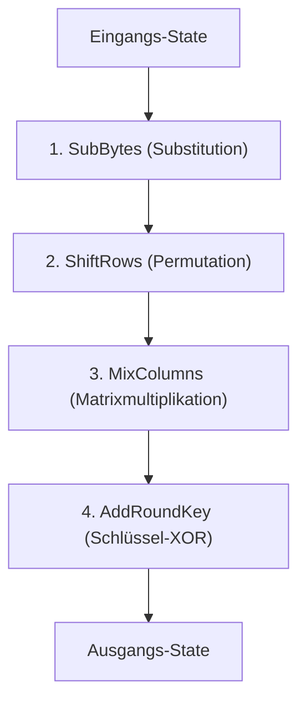

#Note

2026-06-22

Tags: [[IT-Sicherheit]], [[Kryptographie]], [[Symmetrische-Kryptographie]]
#it_security

---

### AES (Advanced Encryption Standard)

Der **Advanced Encryption Standard (AES)** ist der weltweite Standard für symmetrische Blockverschlüsselung (2001 als Nachfolger von DES etabliert, basierend auf dem *Rijndael*-Algorithmus).

---

#### 1. Grundlagen & Design
Im Gegensatz zu DES nutzt AES **kein Feistel-Netzwerk**, sondern ein **Substitutions-Permutations-Netzwerk (SPN)**.

* **Blockgröße**: Festgelegt auf **128 Bit**. Der Block wird als $4 \times 4$-Matrix von Bytes (der sogenannte *State*) interpretiert:
  $$\begin{pmatrix} s_{0,0} & s_{0,1} & s_{0,2} & s_{0,3} \\ s_{1,0} & s_{1,1} & s_{1,2} & s_{1,3} \\ s_{2,0} & s_{2,1} & s_{2,2} & s_{2,3} \\ s_{3,0} & s_{3,1} & s_{3,2} & s_{3,3} \end{pmatrix}$$
* **Schlüssellänge & Rundenanzahl ($N_r$)**:
  * 128-Bit Schlüssel $\rightarrow$ 10 Runden
  * 192-Bit Schlüssel $\rightarrow$ 12 Runden
  * 256-Bit Schlüssel $\rightarrow$ 14 Runden

---

#### 2. Aufbau einer AES-Runde
Jede reguläre Runde besteht aus vier Schichten:



1. **SubBytes (Byte-Substitution)**: Jedes Byte des States wird einzeln durch ein nichtlineares Byte ersetzt (mittels der AES S-Box).
2. **ShiftRows (Zeilenverschiebung)**: Die Zeilen des States werden zyklisch nach links verschoben. Zeile 0 um 0 Bytes, Zeile 1 um 1 Byte, Zeile 2 um 2 Bytes, Zeile 3 um 3 Bytes (sorgt für Diffusion zwischen den Spalten).
3. **MixColumns (Spaltenmischung)**: Die Spalten des States werden mathematisch miteinander vermischt (durch Multiplikation mit einer festen Matrix im Körper $GF(2^8)$). **Achtung**: In der allerletzten Runde wird MixColumns weggelassen.
4. **AddRoundKey (Rundenschlüssel-Add)**: Der State wird per XOR mit dem jeweiligen Rundenschlüssel verknüpft.

---

#### 3. Key Expansion (Schlüsseleinteilung)
Aus dem geheimen Hauptschlüssel generiert der AES-Schlüsselplan (Key Schedule) insgesamt $N_r + 1$ Rundenschlüssel (einen für die initiale Vorrunde, je einen für jede der $N_r$ Runden).

**Verknüpfte Zettel:**
- [[Matrizen]] (Der AES-State wird als Matrix modelliert)

---
#### Flashcards

Was ist der strukturelle Hauptunterschied zwischen AES und DES?::AES basiert auf einem Substitutions-Permutations-Netzwerk (SPN) und verarbeitet den gesamten Block in jeder Runde parallel. DES nutzt ein Feistel-Netzwerk und verarbeitet pro Runde nur die Hälfte des Blocks.

Welche Blockgröße und welche Schlüssellängen unterstützt AES?::Die Blockgröße beträgt immer 128 Bit. Die unterstützten Schlüssellängen sind 128, 192 und 256 Bit.

Welche Operation wird in der finalen Runde von AES weggelassen?::Die MixColumns-Operation (Spaltenmischung).

---
### Verwendung
```dataview
TABLE file.mtime AS "Bearbeitet"
FROM [[AES]]
SORT file.mtime DESC
```
