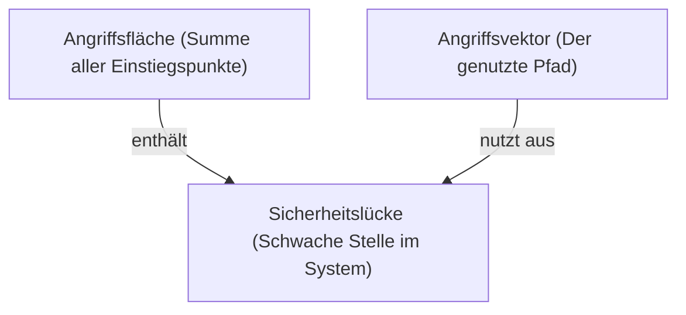

#Note

2026-06-22

Tags: [[Cyber-Security]], [[IT-Sicherheit]], [[Grundlagen]]
#it_security

---

### Grundlagen von Angriffen (Haus-Analogie)

Um Sicherheitskonzepte zu entwerfen, müssen die Begriffe **Sicherheitslücke**, **Angriffsfläche** und **Angriffsvektor** klar definiert und voneinander abgegrenzt werden.



#### 🏠 Die Haus-Analogie
* **Sicherheitslücke (Vulnerability)**: Ein offenes, unverschlossenes Fenster im ersten Stock.
* **Angriffsfläche (Attack Surface)**: Die Summe aller Türen, Fenster, Kellerluken und des Schornsteins – also alle theoretischen Punkte, über die jemand das Haus betreten könnte.
* **Angriffsvektor (Attack Vector)**: Eine Leiter an die Hauswand stellen und durch das offene Fenster klettern.

---

#### 💻 Technische Definitionen

##### 1. Sicherheitslücke (Vulnerability)
* **Definition**: Eine Schwachstelle in einer Software, Hardware oder einem organisatorischen Prozess, die von einem Angreifer ausgenutzt werden kann, um Sicherheitsrichtlinien zu verletzen.
* **Beispiel**: Ein fehlendes Überprüfen von Benutzereingaben (Input Validation) in einer Webanwendung (z. B. führt zu SQL-Injection).

##### 2. Angriffsfläche (Attack Surface)
* **Definition**: Die Gesamtheit aller Punkte (Schnittstellen, Protokolle, Dienste, physische Zugänge, menschliche Faktoren), über die ein unbefugter Benutzer Daten eingeben oder extrahieren kann.
* **Analyse durch Angreifer**:
  * **Passives Reconnaissance**: Sammeln von Infos über WHOIS, Shodan oder offene Quellen (OSINT).
  * **Aktives Scannen**: Portscans (z. B. mit *Nmap*), Schwachstellenscanner (z. B. *Nessus*) zur Erkennung aktiver Dienste.
  * **Threat Modeling**: Abbildung des Datenflusses zur Identifikation kritischer Schnittstellen.
* **Minimierung**: Schließen ungenutzter Ports, Deaktivieren nicht benötigter APIs (Prinzip der minimalen Angriffsfläche).

##### 3. Angriffsvektor (Attack Vector)
* **Definition**: Der Pfad oder die Methode, mit der ein Angreifer Zugriff auf ein System erlangt oder eine Schwachstelle ausnutzt, um Schaden anzurichten.
* **Beispiele**: Phishing-E-Mails (Mensch als Vektor), SQL-Injections, Schadcode auf USB-Sticks (Rubber Ducky), Man-in-the-Middle-Angriffe im öffentlichen WLAN.

**Verknüpfte Zettel:**
- [[SQL-Injection]] (Beispiel für eine Sicherheitslücke und einen Angriffsvektor)

---
#### Flashcards

Wie lautet die Haus-Analogie für Sicherheitslücke, Angriffsfläche und Angriffsvektor?::Sicherheitslücke = unverschlossenes Fenster; Angriffsfläche = alle Türen/Fenster; Angriffsvektor = Leiter anstellen und durchs Fenster klettern.

Was beschreibt die Angriffsfläche (Attack Surface) eines IT-Systems?::Die Summe aller Punkte und Schnittstellen (z. B. offene Ports, APIs, Anmeldeseiten), über die ein Angreifer versuchen kann, in das System einzudringen.

Wie analysiert ein Angreifer typischerweise die Angriffsfläche eines Unternehmens?
?
Durch:
1. **Reconnaissance**: Passive Informationsbeschaffung (OSINT, Shodan).
2. **Aktives Scannen**: Identifikation offener Ports, Protokolle und Betriebssystemversionen (Nmap).
3. **Schwachstellenscans**: Identifikation bekannter Lücken in gefundenen Diensten.

---
### Verwendung
```dataview
TABLE file.mtime AS "Bearbeitet"
FROM [[Angriffsgrundlagen]]
SORT file.mtime DESC
```