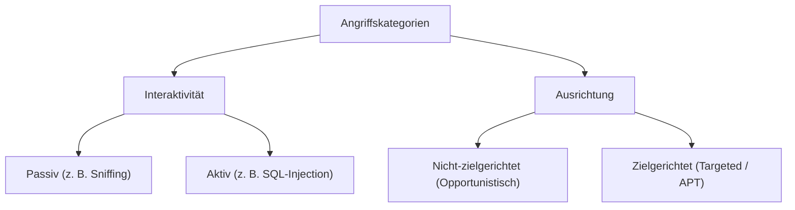

#Note

2026-06-22

Tags: [[Cyber-Security]], [[IT-Sicherheit]], [[Grundlagen]]
#it_security

---

### Klassifizierung von Angriffen (Attack Categories)

Angriffe auf IT-Systeme lassen sich anhand ihrer Art der Interaktion (Passiv vs. Aktiv) und ihrer strategischen Ausrichtung (Nicht-zielgerichtet vs. Zielgerichtet) klassifizieren.



---

#### 1. Passiv vs. Aktiv

##### Passive Angriffe (Passive Attacks)
* **Definition**: Der Angreifer beobachtet, analysiert oder liest Datenverkehr mit, **ohne** die Daten zu verändern oder das System zu stören.
* **Ziel**: Informationsbeschaffung (Spying, Eavesdropping).
* **Beispiel**: Paketsniffing im unverschlüsselten WLAN, Verkehrsflussanalyse.
* **Erkennbarkeit**: Extrem schwer zu erkennen, da der reguläre Betrieb des IT-Systeme unbeeinflusst bleibt. Vorbeugung erfolgt primär durch Verschlüsselung.

##### Aktive Angriffe (Active Attacks)
* **Definition**: Der Angreifer verändert Daten, speist eigenen Code ein, manipuliert Systemzustände oder stört die Dienstverfügbarkeit.
* **Ziel**: Systemübernahme, Sabotage, Erpressung.
* **Beispiel**: [[SQL-Injection]], Man-in-the-Middle-Angriff mit Datenänderung, DDoS-Angriff.
* **Erkennbarkeit**: Meist leichter zu erkennen als passive Angriffe (durch Fehlermeldungen, Systemausfälle, IPS-Meldungen).

---

#### 2. Nicht-zielgerichtet vs. Zielgerichtet

##### Nicht-zielgerichtete Angriffe (Opportunistic / Mass Attacks)
* **Definition**: Der Angreifer sucht automatisiert nach beliebigen Systemen, die eine bestimmte Schwachstelle aufweisen. Das konkrete Opfer ist ihm egal.
* **Ziel**: Schneller, einfacher Erfolg bei minimalem Aufwand.
* **Beispiel**: Breite Spam-Wellen mit Ransomware-Anhang, automatisierte Portscans im Internet nach ungesicherten Datenbanken.

##### Zielgerichtete Angriffe (Targeted Attacks)
* **Definition**: Ein konkretes Unternehmen oder eine Institution wird als Ziel ausgewählt. Der Angreifer analysiert im Vorfeld genau die Infrastruktur und die Mitarbeiter des Opfers.
* **Ziel**: Wirtschaftsspionage, Sabotage kritischer Infrastrukturen, Erpressung mit hohem Lösegeld.
* **Beispiel**: Spear-Phishing gegen Finanzverantwortliche (CEO-Fraud), Advanced Persistent Threats (APTs) durch staatliche Akteure.

---

#### ⚖️ Welche Kategorie ist für Unternehmen am gefährlichsten?
**Zielgerichtete, aktive Angriffe (insb. APTs)** stellen die größte Bedrohung für Unternehmen dar.

* **Begründung**:
  * Im Gegensatz zu opportunistischen Angriffen lässt sich ein zielgerichteter Angreifer nicht durch einfache Standard-Sicherheitsbarrieren (wie Standard-Firewalls) abhalten.
  * Der Angreifer investiert viel Zeit und Ressourcen (Reconnaissance), nutzt oft zuvor unbekannte Schwachstellen (Zero-Day-Exploits) und passt seine Methoden maßgeschneidert an das Abwehrsystem des Opfers an.
  * Solche Angriffe verlaufen oft über Monate hinweg unentdeckt im Hintergrund.

**Verknüpfte Zettel:**
- [[SQL-Injection]] (Beispiel für einen aktiven Angriff)
- [[Nebenläufigkeitsanomalie]] (Beispiel für aktive Manipulation im Ablauf)

---
#### Flashcards

Was unterscheidet einen passiven von einem aktiven Angriff?::Ein passiver Angriff liest nur mit (z. B. Sniffing), während ein aktiver Angriff Daten verändert, Dienste stört oder Befehle injiziert.

Warum sind passive Angriffe so schwer zu erkennen?::Weil sie den regulären Betrieb und den Datenfluss des Systems nicht verändern. Sie hinterlassen in der Regel keine direkten Fehlermeldungen.

Welche Angriffsart ist für ein Unternehmen am gefährlichsten und warum?
?
**Zielgerichtete aktive Angriffe (APTs)**, da sich der Angreifer gezielt auf die Abwehrmittel des konkreten Unternehmens vorbereitet und hartnäckig maßgeschneiderte Methoden (inkl. Zero-Days) einsetzt, bis er eindringen kann.

---
### Verwendung
```dataview
TABLE file.mtime AS "Bearbeitet"
FROM [[Angriffskategorien]]
SORT file.mtime DESC
```