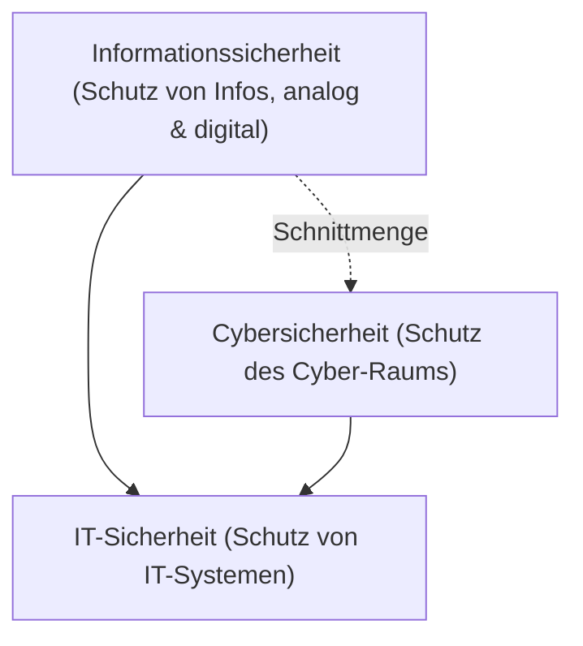

#Note

2026-06-22

Tags: [[Cyber-Security]], [[IT-Sicherheit]], [[Grundlagen]]
#it_security

---

### Begriffsabgrenzung in der Sicherheit

In der Praxis werden die Begriffe *IT-Sicherheit*, *Informationssicherheit* und *Cybersicherheit* (oder Cyber-Security) oft synonym verwendet. Sie besitzen jedoch unterschiedliche Scopes und Zielsetzungen.



#### 1. IT-Sicherheit (IT Security)
* **Definition**: Schutz von informationstechnischen Systemen (Hardware, Software, Netzwerkinfrastruktur) vor Schäden, Missbrauch und unberechtigtem Zugriff.
* **Fokus**: Technische Umsetzung, Systemsicherheit, Funktionsfähigkeit.
* **Beispiel**: Absichern eines Linux-Servers durch Firewalls, Beheben von Buffer Overflows im Code.

#### 2. Informationssicherheit (Information Security / InfoSec)
* **Definition**: Schutz von Informationen jeglicher Art (sowohl digital als auch analog/physisch, z. B. Papierakten, mündliche Kommunikation, Know-how) bezüglich ihrer Vertraulichkeit, Integrität und Verfügbarkeit.
* **Fokus**: Wert der Information selbst, unabhängig vom Trägermedium.
* **Beispiel**: Richtlinien zur Aktenvernichtung (Clean Desk Policy), NDA-Verträge, Klassifizierung von Geschäftsgeheimnissen.

#### 3. Cybersicherheit (Cyber Security)
* **Definition**: Schutz des gesamten "Cyber-Raums", d. h. aller mit dem Internet verbundenen Systeme, Netze, Daten und darauf aufbauenden Dienste sowie kritischer Infrastrukturen (KRITIS).
* **Fokus**: Globale Vernetzung, staatliche/organisierte Bedrohungen (APTs), Schutz kritischer Systeme.
* **Beispiel**: Abwehr von staatlich gesteuerten Spionageangriffen auf Stromnetze, Schutz vor globalen Botnetzen.

#### Bedeutung der Abgrenzung in der Praxis
* **Verantwortlichkeiten**: IT-Sicherheit liegt meist beim IT-Betrieb/CISO; Informationssicherheit betrifft das gesamte Risikomanagement, HR und Legal.
* **Compliance & Standards**: ISO/IEC 27001 fokussiert sich auf *Informationssicherheit* (ISMS), während nationale Gesetze (z. B. das IT-Sicherheitsgesetz in Deutschland) oft explizit die *Cybersicherheit* von KRITIS-Betreibern regulieren.

**Verknüpfte Zettel:**
- [[Daten]] (Strukturierte Repräsentation von Werten)
- [[Information]] (Kontextualisierte und interpretierte Daten)
- [[Wissen]] (Vernetzte und handlungsrelevante Information)

---
#### Flashcards

Was ist der Hauptunterschied im Scope von Informationssicherheit und IT-Sicherheit?::Informationssicherheit schützt alle Informationen (analog und digital); IT-Sicherheit schützt ausschließlich technische IT-Systeme.

Warum ist die Abgrenzung zur Cybersicherheit wichtig für KRITIS-Betreiber?
?
Weil Cybersicherheit den Schutz kritischer, vernetzter Infrastrukturen gegen hochgradig organisierte Bedrohungen (wie Advanced Persistent Threats) fokussiert und gesetzlich strengeren Auflagen (z. B. IT-Sicherheitsgesetz) unterliegt als die klassische IT-Sicherheit.

Welcher Standard adressiert primär Informationssicherheit und auf welchen Bereich zielt das IT-Sicherheitsgesetz ab?::ISO/IEC 27001 fokussiert die ganzheitliche Informationssicherheit (ISMS); das IT-Sicherheitsgesetz reguliert explizit die Cybersicherheit von KRITIS-Betreibern (z. B. Energie, Wasser, Gesundheitswesen).

---
### Verwendung
```dataview
TABLE file.mtime AS "Bearbeitet"
FROM [[Begriffsabgrenzung]]
SORT file.mtime DESC
```