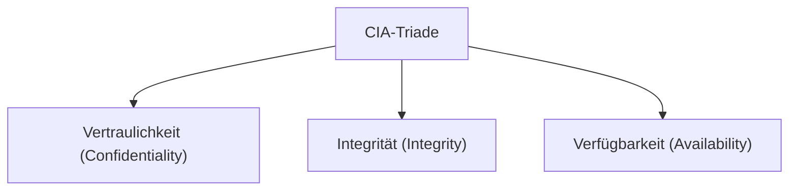

#Note

2026-06-22

Tags: [[Cyber-Security]], [[IT-Sicherheit]], [[Grundlagen]]
#it_security

---

### Die CIA-Triade (Schutzziele)

Die **CIA-Triade** beschreibt die drei grundlegenden Schutzziele der Informationssicherheit: **Vertraulichkeit** (Confidentiality), **Integrität** (Integrity) und **Verfügbarkeit** (Availability). Sie dient als Basis für Risikoanalysen und Sicherheitsarchitekturen.



#### 1. Vertraulichkeit (Confidentiality)
* **Definition**: Daten sind nur für autorisierte Personen zugänglich. Unbefugte Offenlegung wird verhindert.
* **Maßnahmen**: Symmetrische und asymmetrische Verschlüsselung, Rollen- und Rechtekonzepte (Access Control Lists), Multi-Faktor-Authentifizierung (MFA).

#### 2. Integrität (Integrity)
* **Definition**: Daten sind korrekt, vollständig und unverändert. Unautorisierte Modifikationen werden verhindert oder zumindest zuverlässig erkannt.
* **Maßnahmen**: Kryptographische Hash-Funktionen, digitale Signaturen, Prüfsummen (Checksums), Schreibschutz.

#### 3. Verfügbarkeit (Availability)
* **Definition**: Autorisierte Benutzer können auf Daten und Systeme zugreifen, wann immer sie diese benötigen.
* **Maßnahmen**: Redundante Hardware (RAID, Cluster), regelmäßige Backups, Ausweichrechenzentren, DDoS-Abwehr (Load Balancing).

---

#### ⚖️ Konflikte und Balance innerhalb der Triade
Die gleichzeitige Einhaltung aller drei Schutzziele ist eine ständige Herausforderung, da Maßnahmen für ein Ziel oft ein anderes schwächen.

* **Konfliktbeispiel 1 (Confidentiality vs. Availability)**:
  * Durch extrem komplexe Verschlüsselungsverfahren und ständige MFA-Abfragen wird die Vertraulichkeit maximiert.
  * Gleichzeitig sinkt die Verfügbarkeit (oder Usability) der Daten für Benutzer, und bei einem Schlüsselverlust sind die Daten permanent unzugänglich.
* **Konfliktbeispiel 2 (Integrity vs. Availability)**:
  * Um die Integrität einer Datenbank zu garantieren, werden Transaktionen serialisiert und strenge Sperren gesetzt.
  * Dies verringert den Durchsatz und schränkt die Verfügbarkeit für parallele Zugriffe ein.

#### Lösungsansatz
Unternehmen müssen basierend auf einer **Risikoanalyse** entscheiden, welches Schutzziel für welches Asset Priorität hat (z. B. Vertraulichkeit bei Patientendaten, Verfügbarkeit beim Webshop).

**Verknüpfte Zettel:**
- [[Datenintegrität]] (Integrität auf Datenbankebene)
- [[Rechteverwaltung]] (Realisierung von Vertraulichkeit)
- [[CAP-Theorem]] (Verfügbarkeit vs. Konsistenz in verteilten Systemen)
- [[Replikation]] (Erhöhung der Verfügbarkeit von Daten)

---
#### Flashcards

Was bedeuten die Begriffe Vertraulichkeit, Integrität und Verfügbarkeit konkret?::Vertraulichkeit: Nur Berechtigte lesen; Integrität: Keine unbefugte Änderung; Verfügbarkeit: Zugriff bei Bedarf gewährleistet.

Wie stehen Vertraulichkeit und Verfügbarkeit typischerweise im Konflikt?
?
Durch strenge Zugriffsbarrieren (Verschlüsselung, MFA, Firewalls) wird der Zugriff erschwert (Vertraulichkeit erhöht), was bei Systemausfällen oder Schlüsselverlusten den berechtigten Zugriff verhindern kann (Verfügbarkeit sinkt).

Nenne je eine typische technische Maßnahme für Vertraulichkeit, Integrität und Verfügbarkeit.
?
- **Vertraulichkeit**: Verschlüsselung (z. B. AES, TLS) und Zugriffskontrollen (MFA, ACLs).
- **Integrität**: Kryptographische Hash-Funktionen und digitale Signaturen.
- **Verfügbarkeit**: Redundanz (RAID, Cluster), regelmäßige Backups und DDoS-Schutz.

---
### Verwendung
```dataview
TABLE file.mtime AS "Bearbeitet"
FROM [[CIA-Triade]]
SORT file.mtime DESC
```