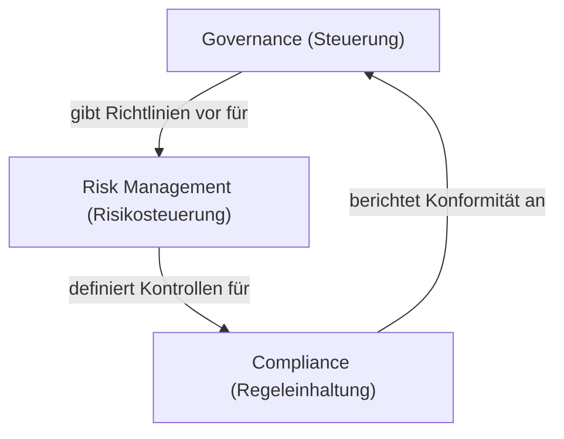

#Note

2026-06-22

Tags: [[IT-Sicherheit]], [[GRC]], [[Grundlagen]]
#it_security

---

### Governance, Risk & Compliance (GRC)

**GRC** ist ein integrierter Managementansatz, der sicherstellt, dass eine Organisation ihre Ziele erreicht, Risiken angemessen steuert und gesetzliche sowie interne Vorgaben einhält.



#### Die drei Säulen von GRC

##### 1. Governance (Unternehmenssteuerung)
* **Definition**: Der Rahmen aus Regeln, Praktiken und Prozessen, über den ein Unternehmen geleitet und kontrolliert wird.
* **Fokus**: Ausrichtung der IT-Sicherheitsstrategie an den allgemeinen Geschäftszielen (Alignment), Festlegung von Verantwortlichkeiten (z. B. Rollen von CISO, Vorstand) und Erlass von IT-Sicherheitsrichtlinien (Policies).

##### 2. Risk Management (Risikomanagement)
* **Definition**: Der systematische Prozess der Identifikation, Analyse, Bewertung und Bewältigung von Risiken, die das Erreichen der Unternehmensziele gefährden könnten.
* **Fokus**: Abwägung zwischen Kosten für Sicherheitsmaßnahmen und dem potenziellen Schaden von Bedrohungen (z. B. Cyberangriffen).

##### 3. Compliance (Regeleinhaltung)
* **Definition**: Die Einhaltung aller relevanten externen Gesetze, Standards sowie interner Richtlinien und vertraglicher Vereinbarungen.
* **Fokus**: Nachweisbarkeit (Auditierung) und Einhaltung von Vorgaben (z. B. DSGVO, ISO 27001).

---

#### ⚖️ Integration in der Praxis
In modernen Unternehmen können diese drei Disziplinen nicht mehr isoliert ("in Silos") betrachtet werden:
* **Beispiel**: Die *Governance* beschließt eine "Clean Desk Policy". Das *Risk Management* hat zuvor bewertet, dass das Risiko von physischem Datendiebstahl hoch ist. Die *Compliance* prüft durch regelmäßige Audits, ob die Mitarbeiter ihre Schreibtische beim Verlassen tatsächlich aufräumen.

**Verknüpfte Zettel:**
- [[Jahresabschlussgrundlagen]] (Relevanz von GRC für die ordnungsgemäße Buchführung und Berichterstattung)

---
#### Flashcards

Wofür steht das Akronym GRC?::Governance, Risk Management und Compliance.

Wie greifen die drei GRC-Komponenten in der Praxis ineinander?
?
* **Governance** setzt die strategischen Ziele und Sicherheitsrichtlinien.
* **Risk Management** bewertet Bedrohungen gegen diese Ziele und bestimmt Maßnahmen.
* **Compliance** kontrolliert und dokumentiert, ob diese Maßnahmen und gesetzliche Regeln eingehalten werden.

---
### Verwendung
```dataview
TABLE file.mtime AS "Bearbeitet"
FROM [[GRC]]
SORT file.mtime DESC
```
