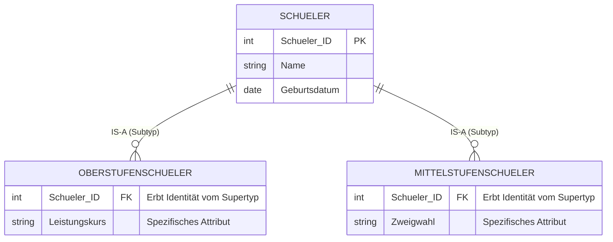

#Note

2026-06-09

Tags: [[Datenbanken]], [[Datenbankentwurf]], [[Entity-Relationship-Modell]]
#datenbanken 

---
Die **Generalisierung** (und ihr Gegenstück, die Spezialisierung) bezeichnet einen Abstraktionsvorgang im konzeptionellen Datenbankentwurf, bei dem ähnliche Entitytypen (Subentitytypen) zu einem übergeordneten, allgemeineren Entitytyp (Superentitytyp) zusammengefasst werden.

Die logische Verbindung zwischen Super- und Subtyp wird als **IS-A-Beziehung** (_"ist ein"_) bezeichnet (z. B. Ein Oberstufenschüler _IS-A_ Schüler).

#### Vererbung von Attributen

Der wesentliche Vorteil dieses Modells ist die **Vererbung**: Die Subtypen erben automatisch alle Attribute (und Assoziationen) des Supertyps. Zusätzlich können die Subtypen um eigene, hochspezifische Attribute erweitert werden, die auf den Supertyp nicht zutreffen.

#### Die 4 Klassifikationsfälle

Die Zuordnung von Entitäten zu ihren Subtypen wird durch zwei logische Einschränkungen definiert: **Disjunktheit** (Darf es Überschneidungen geben?) und **Vollständigkeit** (Muss jedes Element des Supertyps zwingend einem Subtyp angehören?). Daraus ergeben sich vier Kombinationsmöglichkeiten:

|Fall|Einschränkung|Beschreibung|Beispiel aus dem Skript|
|---|---|---|---|
|**Überlappend**|Weder / Noch|Eine Entität _kann_ zu mehreren Subtypen gehören, _muss_ aber nicht.|Mitarbeiter → Entwickler, Projektleiter (kann beides sein oder keines).|
|**Überlappend-vollständig**|Nur Vollständig|Eine Entität _kann_ zu mehreren gehören, _muss_ aber zwingend mindestens einem angehören.|Fahrzeug → PKW, Transporter (Ein PKW-Transporter ist beides).|
|**Disjunkt**|Nur Disjunkt|Eine Entität darf _höchstens_ einem Subtyp angehören (keine Überschneidung), darf aber auch gar keinem angehören.|Konto → Girokonto, Sparkonto (Niemals beides gleichzeitig).|
|**Disjunkt-vollständig**|Disjunkt + Vollständig|Eine Entität gehört _zu genau einem_ Subtyp (strenge Trennung + vollständige Abdeckung).|Mitarbeiter → Festangestellter, Freelancer.|

Code-Implementation (Konzeptionelle Darstellung)

_(Da SQL DDL keine direkte "IS-A" Syntax wie objektorientierte Sprachen besitzt, wird dies im konzeptionellen ERD-Design definiert.)_



--------------------------------------------------------------------------------

### Flashcards

Was versteht man unter Generalisierung/Spezialisierung im Entity-Relationship-Modell?::Einen Abstraktionsvorgang, bei dem einzelne, ähnliche Entitytypen (Subtypen) zu einem übergeordneten Entitytyp (Supertyp) zusammengefasst werden. Man nennt dies auch eine IS-A-Beziehung.
<!--SR:!2026-06-10,0,230-->

Was ist das wichtigste funktionale Merkmal einer IS-A-Beziehung in Bezug auf die Eigenschaften der Entitäten?::Die Vererbung. Die Subtypen "erben" alle Attribute des Supertyps und können zusätzlich eigene, spezifische Attribute besitzen.

Wie unterscheidet sich ein "disjunkter" von einem "überlappenden" Subentitytyp?
?
**Disjunkt:** Eine Entität des Supertyps darf _höchstens_ einem Subtyp angehören (strenge Trennung, z.B. Girokonto oder Sparkonto). **Überlappend:** Eine Entität darf _gleichzeitig mehreren_ Subtypen angehören (z.B. Mitarbeiter ist Entwickler und Projektleiter).
<!--SR:!2026-06-10,0,230-->

Was bedeutet "Vollständigkeit" (vollständige Subentitytypen) bei der Generalisierung?::Es bedeutet, dass jede Entität des Supertyps _zwingend mindestens einem_ Subtyp angehören muss. Es gibt also keine Entitäten, die "nur" in der Superklasse existieren, ohne spezifiziert zu sein.

Was ist ein "disjunkt-vollständiger" Subentitytyp?
?
Die strengste Form der Klassifikation: Eine Entität des Supertyps gehört zu **genau einem** Subtyp. Es gibt keine Überschneidungen (disjunkt) und keine Elemente außerhalb der Subtypen (vollständig). Beispiel: Ein Mitarbeiter ist zwingend _entweder_ Festangestellter _oder_ Freelancer.


---
### Verwendung
```dataview
TABLE file.mtime AS "Bearbeitet"
FROM [[Generalisierung]]
SORT file.mtime DESC
```