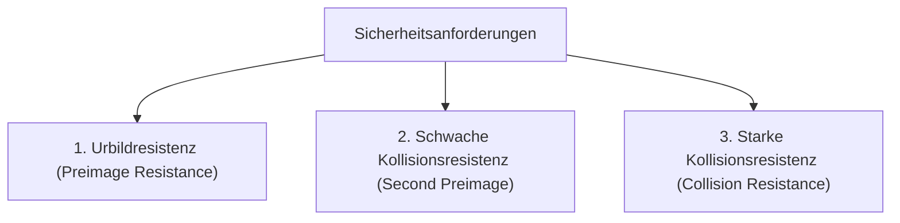

#Note

2026-06-22

Tags: [[IT-Sicherheit]], [[Kryptographie]], [[Hashing]]
#it_security

---

### Hashfunktionen

Eine **kryptographische Hash-Funktion** ist eine mathematische Einwegfunktion, die eine Nachricht beliebiger Länge auf eine Ausgabe fester Länge (den sogenannten *Hashwert* oder *Fingerabdruck*) abbildet.

---

#### 1. Grundlegende Eigenschaften
* **Deterministisch**: Die Eingabe derselben Nachricht erzeugt immer exakt denselben Hashwert.
* **Feste Ausgabelänge**: Unabhängig davon, ob ein Wort oder eine komplette Festplatte gehasht wird, ist der Hashwert immer gleich lang (z. B. 256 Bit bei SHA-256).
* **Lawineneffekt**: Eine minimale Änderung in der Eingabe (z. B. ein einzelner Punkt) erzeugt einen völlig anderen Hashwert.
* **Einwegfunktion (Irreversibilität)**: Es ist mathematisch unmöglich, aus dem Hashwert die Originalnachricht zu berechnen. **Deshalb ist Hashing keine Verschlüsselung** (da Verschlüsselung immer umkehrbar sein muss).

---

#### 2. Die drei Sicherheitsanforderungen



##### 1. Urbildresistenz (Preimage Resistance)
* *Definition*: Gegeben ist ein Hashwert $h$. Es ist praktisch unmöglich, eine Nachricht $m$ zu finden, für die gilt:
  $$H(m) = h$$
* *Bedeutung*: Verhindert das Rückrechnen von Passwörtern aus gespeicherten Hashes.

##### 2. Schwache Kollisionsresistenz (Second Preimage Resistance)
* *Definition*: Gegeben ist eine Nachricht $m_1$. Es ist praktisch unmöglich, eine andere Nachricht $m_2 \neq m_1$ zu finden, die denselben Hashwert hat:
  $$H(m_1) = H(m_2)$$
* *Bedeutung*: Verhindert, dass ein Angreifer ein legitimes Dokument durch ein manipuliertes Dokument mit identischem Hash austauscht.

##### 3. Starke Kollisionsresistenz (Collision Resistance)
* *Definition*: Es ist praktisch unmöglich, *irgendein* beliebiges Paar zweier unterschiedlicher Nachrichten $m_1 \neq m_2$ zu finden, für das gilt:
  $$H(m_1) = H(m_2)$$
* *Bedeutung*: Schützt digitale Signaturen davor, dass zwei unterschiedliche Dokumente dieselbe Signatur tragen.

---

#### 3. Beispiele und Status

##### Sichere Hash-Funktionen
* **SHA-256 / SHA-512 (SHA-2)**: Weit verbreiteter Standard.
* **SHA-3 (Keccak)**: Neuerer Standard, basiert auf einer anderen Struktur (Sponge-Konstruktion) als SHA-2.
* **BLAKE2 / BLAKE3**: Extrem schnelle, sichere Hashfunktionen.

##### Unsichere Hash-Funktionen (Veraltet)
* **MD5**: Seit 2004 kollisionsgefährdet. Kollisionen können heute in Sekunden auf dem Smartphone erzeugt werden.
* **SHA-1**: Kollisionen wurden 2017 nachgewiesen (SHAttered-Angriff). Darf nicht mehr verwendet werden.

---
#### Flashcards

Warum ist Hashing keine Verschlüsselung?::Weil Hashing eine Einwegfunktion (irreversibel) ist, während eine Verschlüsselung immer umkehrbar sein muss, um die Originaldaten wiederherzustellen.

Was fordert die Urbildresistenz (Preimage Resistance) bei Hashfunktionen?::Dass es aus einem gegebenen Hashwert $h$ praktisch unmöglich ist, die zugehörige Nachricht $m$ zu finden, sodass $H(m) = h$.

Warum ist MD5 heute als unsicher eingestuft?::Weil die starke Kollisionsresistenz gebrochen ist. Angreifer können mit minimalem Aufwand zwei unterschiedliche Dokumente erzeugen, die denselben MD5-Hashwert haben.

---
### Verwendung
```dataview
TABLE file.mtime AS "Bearbeitet"
FROM [[Hashfunktionen]]
SORT file.mtime DESC
```
