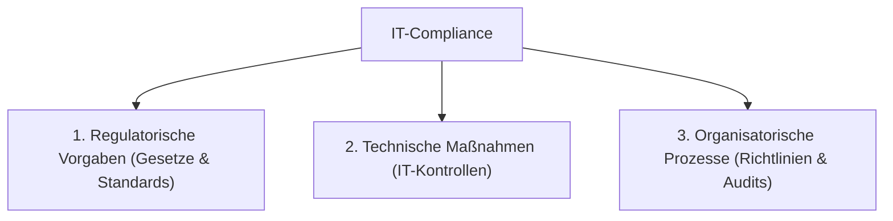

#Note

2026-06-22

Tags: [[IT-Sicherheit]], [[GRC]], [[Compliance]]
#it_security

---

### IT-Compliance

**IT-Compliance** beschreibt die Einhaltung gesetzlicher, regulatorischer, vertraglicher und interner Vorgaben im Bereich der Informationstechnologie.

---

#### Die drei Säulen der IT-Compliance
Um Compliance-Vorgaben (wie z. B. die DSGVO oder NIS-2) zu erfüllen, müssen Maßnahmen in drei Dimensionen umgesetzt werden:



1. **Regulatorische Vorgaben (Vorgabenebene)**:
   * Gesetzliche Anforderungen (z. B. DSGVO zum Schutz personenbezogener Daten, IT-Sicherheitsgesetz für KRITIS-Betreiber).
   * Industriestandards (z. B. ISO/IEC 27001, PCI-DSS für Kreditkartendaten).
2. **Technische Maßnahmen (Umsetzungsebene)**:
   * Konkrete technische Kontrollen in den IT-Systemen.
   * *Beispiele*: Verschlüsselung von Datenbanken, Implementierung von Multi-Faktor-Authentifizierung (MFA), Protokollierung von Zugriffen.
3. **Organisatorische Prozesse (Prozessebene)**:
   * Vorgaben für das Verhalten der Mitarbeiter und interne Abläufe.
   * *Beispiele*: Erstellung von Sicherheitsrichtlinien, Notfallplänen, Durchführung von Mitarbeiterschulungen und regelmäßigen Compliance-Audits.

---

#### ⚖️ Grenzen der Compliance (Compliance vs. Sicherheit)
Ein kritischer Fehler in der GRC-Praxis ist die Gleichsetzung von Compliance und IT-Sicherheit (**Compliance $\neq$ Sicherheit**).

| Aspekt | **Compliance** | **IT-Sicherheit** |
| :--- | :--- | :--- |
| **Ziel** | Vermeidung von rechtlichen Strafen & Haftung | Schutz vor realen Angriffen & Datenverlust |
| **Charakter** | Statisch und checklistengesteuert (z. B. jährliche Audits) | Dynamisch und bedrohungsorientiert (kontinuierlich) |
| **Ansatz** | Definiert einen gesetzlichen Mindeststandard | Strebt maximalen Schutz basierend auf Risiken an |

* **Risiko**: Ein Unternehmen kann zu 100% compliant sein (alle Checkboxen abgehakt) und trotzdem Opfer eines erfolgreichen Cyberangriffs werden, da die Compliance-Regelungen oft veraltet sind und neuartige Angriffsmethoden (Zero-Day-Exploits) nicht berücksichtigen.

**Verknüpfte Zettel:**
- [[Rechteverwaltung]] (Technische Maßnahme zur Einhaltung von Datenschutzvorgaben)
- [[Datenintegrität]] (Zentrales Schutzziel vieler regulatorischer Standards)

---
#### Flashcards

Was sind die drei Säulen der IT-Compliance?::Regulatorische Vorgaben, Technische Maßnahmen und Organisatorische Prozesse.

Warum reicht Compliance allein nicht aus, um ein Unternehmen sicher zu machen?
?
Weil Compliance statisch ist und nur rechtliche Mindeststandards abfragt, während IT-Sicherheit ein dynamischer, kontinuierlicher Prozess ist, der sich schnell an neuartige Bedrohungen anpassen muss.

Nenne je ein technisches und organisatorisches Beispiel für die Umsetzung der DSGVO-Compliance.::Technisch: Verschlüsselung personenbezogener Daten in der Datenbank. Organisatorisch: Durchführung von Security Awareness Trainings für Mitarbeiter.

---
### Verwendung
```dataview
TABLE file.mtime AS "Bearbeitet"
FROM [[IT-Compliance]]
SORT file.mtime DESC
```
