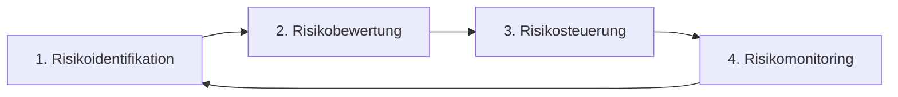

#Note

2026-06-22

Tags: [[IT-Sicherheit]], [[GRC]], [[Risikomanagement]]
#it_security

---

### IT-Risikomanagement

Im Kontext von GRC und IT-Sicherheit dient das **Risikomanagement** dazu, Gefahren für die Schutzziele der [[CIA-Triade]] (Vertraulichkeit, Integrität, Verfügbarkeit) systematisch zu bewerten und zu steuern.

---

#### Der IT-Risikomanagement-Zyklus
Der Prozess ist ein kontinuierlicher Kreislauf und gliedert sich in folgende Phasen:



1. **Risikoidentifikation (Identification)**:
   * Erkennen von Schwachstellen (Vulnerabilities) und potenziellen Bedrohungen (Threats) für IT-Systeme.
   * *Beispiel*: Veraltetes Betriebssystem auf dem Webserver wird als Schwachstelle identifiziert.
2. **Risikobewertung (Assessment / Analysis)**:
   * **Qualitativ**: Einstufung in Stufen (z. B. Hoch, Mittel, Gering) unter Verwendung einer Risikomatrix.
   * **Quantitativ**: Monetäre Bewertung.
     $$\text{Risikowert} = \text{Eintrittswahrscheinlichkeit} \times \text{Schadenshöhe (in Euro)}$$
3. **Risikosteuerung (Response / Treatment)**:
   * Auswahl einer Bewältigungsstrategie:
     * **Vermeiden (Avoid)**: Deaktivieren des betroffenen Dienstes.
     * **Vermindern (Mitigate)**: Installieren von Sicherheits-Patches, Firewalls.
     * **Übertragen (Transfer)**: Abschluss einer Cyber-Versicherung.
     * **Akzeptieren (Accept)**: Das Restrisiko tragen, falls Kosten der Absicherung den Nutzen übersteigen.
4. **Risikomonitoring (Monitoring & Review)**:
   * Kontinuierliche Überwachung, ob die Maßnahmen wirksam sind und ob neue Bedrohungen entstanden sind.

---

#### ⚖️ Besonderheiten im IT-Sicherheits-Kontext
Im Vergleich zum allgemeinen Projektmanagement fließen im IT-Risikomanagement technologische Faktoren direkt in die Schadensberechnung ein:
* **Kettenreaktionen**: Der Ausfall eines zentralen Authentifizierungsdienstes (z. B. LDAP/Active Directory) betrifft sofort Dutzende nachgelagerte Anwendungen.
* **Dynamische Bedrohungslage**: Eintrittswahrscheinlichkeiten können sich durch die Veröffentlichung eines neuen Exploits (z. B. Log4Shell) über Nacht von "gering" auf "extrem hoch" ändern.

**Verknüpfte Zettel:**
- [[Risikomanagement]] (Allgemeine Definition und Grundlagen der 4 Risikostrategien)
- [[CIA-Triade]] (Basis für die Bestimmung der Schadenshöhe)

---
#### Flashcards

Was unterscheidet das IT-Risikomanagement vom allgemeinen Risikomanagement?::IT-Risikomanagement fokussiert sich gezielt auf Bedrohungen für digitale Assets und die Schutzziele Vertraulichkeit, Integrität und Verfügbarkeit.

Aus welchen vier Phasen besteht der IT-Risikomanagement-Zyklus?::Identifikation, Bewertung, Steuerung (Response) und Überwachung (Monitoring).

Warum verändern sich Eintrittswahrscheinlichkeiten im IT-Bereich oft extrem schnell?::Weil durch die Veröffentlichung neuer Sicherheitslücken (Zero-Day-Exploits) oder das Auftauchen neuer Angreifer-Tools bestehende Hürden über Nacht unwirksam werden können.

---
### Verwendung
```dataview
TABLE file.mtime AS "Bearbeitet"
FROM [[Risikomanagement]]
SORT file.mtime DESC
```
