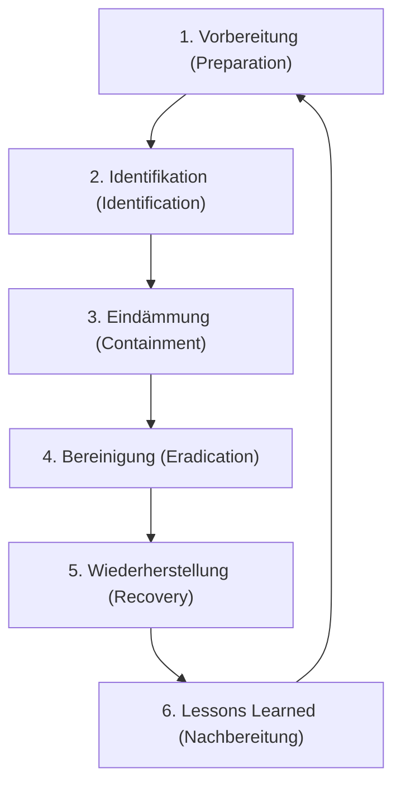

#Note

2026-06-22

Tags: [[IT-Sicherheit]], [[Incident-Response]]
#it_security

---

### Incident Response Zyklus

Der **Incident Response Zyklus** (nach NIST SP 800-61 / SANS Institute) beschreibt die standardisierten Phasen, die ein Sicherheitsteam vor, während und nach einem Vorfall durchläuft.



---

#### Die 6 Phasen des Zyklus

##### 1. Vorbereitung (Preparation)
* **Ziel**: Errichtung der organisatorischen und technischen Grundlagen zur Abwehr von Vorfällen.
* **Maßnahmen**: Etablierung eines Incident Response Teams (CIRT), Bereitstellen von Analyse-Werkzeugen, Erstellen von Richtlinien, Härtung von Systemen.

##### 2. Identifikation (Identification)
* **Ziel**: Erkennen und Validieren von Sicherheitsvorfällen.
* **Maßnahmen**: Auswertung von Log-Dateien, SIEM-Meldungen, Abgrenzung von echten Vorfällen gegenüber False Positives, Bestimmung des Schadensausmaßes.

##### 3. Eindämmung (Containment)
* **Ziel**: Schadensbegrenzung; Verhindern, dass sich die Bedrohung im Netzwerk weiter ausbreitet.
* **Maßnahmen**:
  * *Kurzfristig*: Trennen betroffener Systeme vom Netzwerk (Kabel ziehen / Switch-Port sperren).
  * *Langfristig*: Sperrung von Firewall-Ports, Isolierung virtueller Maschinen.

##### 4. Bereinigung (Eradication)
* **Ziel**: Beseitigung aller Spuren des Angriffs und Schließen der Einfallstore.
* **Maßnahmen**: Löschen von Malware, Entfernen kompromittierter Benutzerkonten, Patchen der ausgenutzten Sicherheitslücke.

##### 5. Wiederherstellung (Recovery)
* **Ziel**: Sicherer Übergang zurück in den Normalbetrieb.
* **Maßnahmen**: Einspielen von Daten aus sauberen Backups, kontinuierliches Monitoring auf erneute Infektionen, schrittweise Freischaltung der Dienste.

##### 6. Lessons Learned (Nachbereitung)
* **Ziel**: Aus dem Vorfall lernen, um zukünftige Risiken zu minimieren.
* **Maßnahmen**: Abschlussbesprechung, Analyse der Reaktionszeit, Update der Notfallpläne und Sicherheitskontrollen.

---

#### 📋 Werkzeuge: Playbooks
Ein **Playbook** ist eine strukturierte, vordefinierte Handlungsanleitung, die das IR-Team Schritt für Schritt durch eine spezifische Incident-Art (z. B. Ransomware, Phishing, Datenabfluss) führt. Sie sorgen für fehlerfreie und schnelle Reaktionen unter hohem Stress.

**Verknüpfte Zettel:**
- [[Schwachstellenkategorien]] (Analysiert in Phasen 2 und 4)
- [[Qualitätsicherung]] (Optimierung von Prozessen durch Lessons Learned)

---
#### Flashcards

Nenne die 6 Phasen des Incident Response Zyklus.::Vorbereitung, Identifikation, Eindämmung, Bereinigung, Wiederherstellung und Lessons Learned.

Was ist der Unterschied zwischen der Eindämmungs- und der Bereinigungsphase?::Eindämmung (Containment) verhindert die Ausbreitung des Schadens im Netz. Bereinigung (Eradication) entfernt die Ursache (z. B. Malware, Sicherheitslücke) permanent.

Wie hilft ein Playbook dem Incident Response Team im Ernstfall?::Es bietet eine klare, vorab getestete Schritt-für-Schritt-Anleitung für spezifische Vorfälle (z. B. Ransomware) und reduziert so Reaktionszeit und Stressfehler.

---
### Verwendung
```dataview
TABLE file.mtime AS "Bearbeitet"
FROM [[Incident Response Zyklus]]
SORT file.mtime DESC
```
