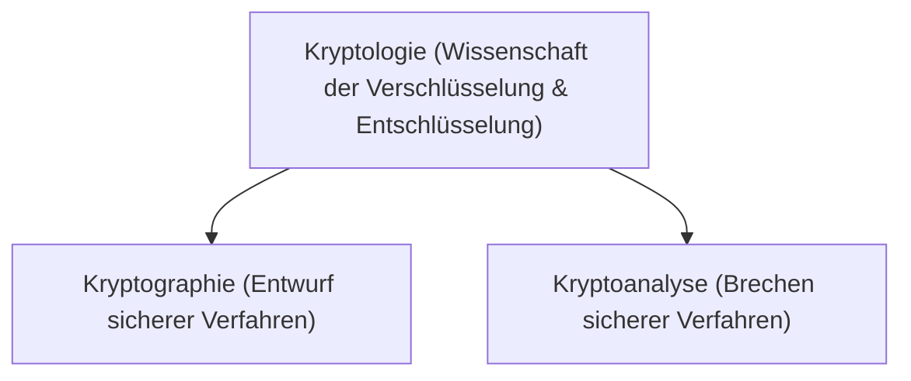

#Note

2026-06-22

Tags: [[IT-Sicherheit]], [[Kryptographie]], [[Grundlagen]]
#it_security

---

### Kryptologie

Die **Kryptologie** (Wissenschaft der Geheimhaltung) ist die übergeordnete Disziplin, die sich mit der Absicherung von Informationen befasst. Sie teilt sich in zwei gegensätzliche, aber sich ergänzende Bereiche auf:



* **Kryptographie**: Der Entwurf und die Entwicklung mathematischer Verfahren, um Daten vertraulich und integer zu übertragen (Schutzseite).
* **Kryptoanalyse**: Die Analyse und das Brechen dieser kryptographischen Verfahren ohne Autorisierung (Angriffsseite).

---

#### 🔐 Kerckhoffs’sches Prinzip (1883)
Das Kerckhoffs’sche Prinzip ist die fundamentale Designregel der modernen Kryptographie:
> *"Die Sicherheit eines kryptographischen Systems darf nicht auf der Geheimhaltung des Algorithmus beruhen. Sie muss allein auf der Geheimhaltung des Schlüssels basieren."*

* **Gegenteil: Security by Obscurity** (Sicherheit durch Verheimlichung). Dies gilt als unsicher, da ein Algorithmus durch Reverse Engineering (z. B. Dekompilieren von Software) immer aufgedeckt werden kann.
* **Vorteil**: Algorithmen können öffentlich analysiert und auf Schwachstellen geprüft werden. Nur wenn Experten weltweit keine Schwachstelle im Algorithmus finden, gilt er als sicher (z. B. AES, RSA).

---

#### 📱 Alltagsbeispiele für Kryptographie
Kryptographische Verfahren sind heute allgegenwärtig:
* **HTTPS / TLS**: Verschlüsselung des Web-Verkehrs beim Online-Banking.
* **WLAN (WPA3)**: Schutz des lokalen Funknetzwerks vor Mithörern.
* **Funk-Autoschlüssel**: Schutz vor Replay-Angriffen durch rollierende Codes (Challenge-Response).
* **Medizinprodukte**: Absicherung von implantierten Herzschrittmachern gegen unbefugte Programmierbefehle über Funk.

---
#### Flashcards

Wie grenzen sich Kryptographie und Kryptoanalyse voneinander ab?::Kryptographie befasst sich mit der Entwicklung sicherer Verschlüsselungsverfahren; Kryptoanalyse versucht, diese zu brechen.

Was besagt das Kerckhoffs’sche Prinzip?::Die Sicherheit eines Kryptosystems darf nur von der Geheimhaltung des Schlüssels abhängen, nicht von der Geheimhaltung des Algorithmus.

Warum ist "Security by Obscurity" in der Kryptographie unsicher?::Weil geheime Algorithmen durch Reverse Engineering oder Leaks offengelegt werden können und ohne öffentliche Prüfung oft fundamentale Fehler enthalten.

---
### Verwendung
```dataview
TABLE file.mtime AS "Bearbeitet"
FROM [[Kryptologie]]
SORT file.mtime DESC
```
