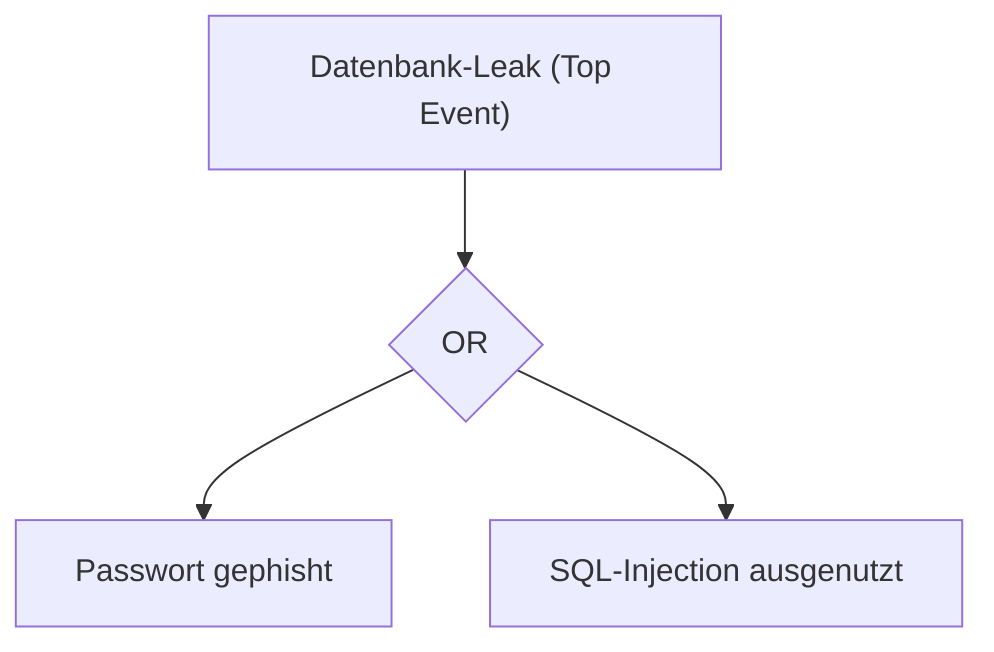

#Note

2026-06-22

Tags: [[IT-Sicherheit]], [[Risikomanagement]], [[Grundlagen]]
#it_security

---

### Methoden des IT-Risikomanagements

Zur Risikoidentifikation und -bewertung in der IT-Sicherheit werden verschiedene etablierte Methoden aus der Betriebswirtschaft und der Systemanalyse eingesetzt.

---

#### 1. SWOT-Analyse (Strengths, Weaknesses, Opportunities, Threats)
Die SWOT-Analyse ist ein strategisches Planungsinstrument. In der IT-Sicherheit dient sie zur Standortbestimmung der Sicherheitslage:
* **Interne Faktoren**:
  * **Strengths (Stärken)**: Gute Mitarbeiterschulung, moderne EDR-Systeme, redundante Backups.
  * **Weaknesses (Schwächen)**: Veraltete Altsysteme (Legacy Software), Fachkräftemangel in der IT.
* **Externe Faktoren**:
  * **Opportunities (Chancen)**: Migration in sichere Cloud-Infrastrukturen, Einführung neuer Standards (NIS-2) zur Budgeterhöhung.
  * **Threats (Risiken)**: Neue regulatorische Bußgelder, Anstieg gezielter Ransomware-Angriffe in der Branche.

---

#### 2. Fault Tree Analysis (FTA / Fehlerbaumanalyse)
Die FTA ist eine **deduktive Top-Down-Methode** zur Zuverlässigkeitsanalyse.
* **Vorgehen**: Man geht von einem unerwünschten Ereignis (dem "Top-Event", z. B. "Datenbank-Leak") aus und analysiert rückwärts, welche Kombinationen von Einzelfehlern dazu führen können.
* **Logische Gatter**: Die Fehlerpfade werden mit Boolescher Logik (AND-/OR-Gattern) verknüpft:
  * *OR-Gatter*: Eines der Ereignisse reicht aus (z. B. Passwort-Diebstahl ODER SQL-Injection führt zu Systemzugriff).
  * *AND-Gatter*: Alle Ereignisse müssen gleichzeitig eintreffen (z. B. Firewall fällt aus UND Admin-Zugang ist unverschlüsselt).



---

#### 3. ALARP-Prinzip (As Low As Reasonably Practicable)
Das **ALARP-Prinzip** beschreibt das wirtschaftliche Optimum im Risikomanagement.
* **Kernidee**: Ein Risiko muss so weit minimiert werden, wie es vernünftigerweise praktikabel ist. 
* **Abwägung**: Es teilt Risiken in drei Zonen:
  1. *Unakzeptable Zone*: Das Risiko ist zu hoch und muss zwingend reduziert werden (unabhängig von den Kosten).
  2. *Tolerable Zone (ALARP)*: Das Risiko ist tolerierbar, falls der finanzielle oder zeitliche Aufwand für eine weitere Reduzierung in keinem Verhältnis (Disproportionalität) zum verbleibenden Risiko steht.
  3. *Akzeptable Zone*: Das Risiko ist so gering, dass keine Maßnahmen nötig sind.

**Verknüpfte Zettel:**
- [[Projektmanagement]] (Allgemeine Planungsmethoden)
- [[Risikomanagement]] (Grundlegender Risikobegriff und -prozess)

---
#### Flashcards

Wie unterscheidet sich die Fault Tree Analysis (FTA) von anderen Analysemethoden?::Die FTA ist eine deduktive Top-Down-Methode, die von einem konkreten Schadensereignis ausgeht und dessen Ursachen über logische Gatter (AND/OR) verknüpft.

Was besagt das ALARP-Prinzip bezüglich der Sicherheitsinvestitionen?::Dass Risiken so weit minimiert werden müssen, wie es wirtschaftlich sinnvoll ist. Ab einem bestimmten Punkt steht der Aufwand für weitere Maßnahmen in keinem gesunden Verhältnis mehr zum Nutzen.

Welche Rolle spielen AND- und OR-Gatter in einer Fehlerbaumanalyse?::Ein OR-Gatter bedeutet, dass bereits ein einziger Fehler das nächste Level auslöst. Ein AND-Gatter erfordert, dass alle untergeordneten Fehler gleichzeitig eintreffen.

---
### Verwendung
```dataview
TABLE file.mtime AS "Bearbeitet"
FROM [[Risikomanagement-Methoden]]
SORT file.mtime DESC
```
