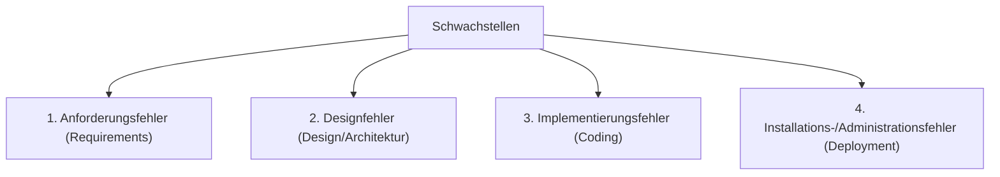

#Note

2026-06-22

Tags: [[Cyber-Security]], [[IT-Sicherheit]], [[Grundlagen]]
#it_security

---

### Kategorien von Schwachstellen (Vulnerabilities)

Schwachstellen in IT-Systemen lassen sich anhand der Phase ihres Entstehens im Software- bzw. Systemlebenszyklus in vier Hauptkategorien einteilen.



#### Die vier Hauptkategorien

##### 1. Anforderungsfehler (Requirements Bugs)
* **Beschreibung**: Sicherheitsanforderungen wurden gar nicht, unvollständig oder fehlerhaft definiert.
* **Beispiel**: In den Spezifikationen wird vergessen vorzuschreiben, dass Benutzerpasswörter gehasht gespeichert werden müssen.

##### 2. Designfehler (Design Bugs)
* **Beschreibung**: Die Systemarchitektur weist konzeptionelle Mängel auf. Das System verhält sich exakt so wie spezifiziert, aber das Design selbst ist unsicher.
* **Beispiel**: Fehlende logische Trennung (Segmentierung) zwischen dem öffentlichen WLAN und dem internen Datenbanknetzwerk.

##### 3. Implementierungsfehler (Coding Bugs)
* **Beschreibung**: Die Anforderungen und das Design waren korrekt, aber beim Schreiben des Quellcodes wurden Fehler gemacht.
* **Beispiel**: Ein Programmierer vergisst eine Grenzwertprüfung, was zu einem *Buffer Overflow* führt, oder es entsteht eine *SQL-Injection* durch mangelnde Parametrisierung.

##### 4. Installations- und Administrationsfehler (Configuration/Deployment Bugs)
* **Beschreibung**: Software und Design sind fehlerfrei, aber das System wurde unsicher in Betrieb genommen oder konfiguriert.
* **Beispiel**: Beibehalten von Standard-Administrator-Passwörtern (z. B. `admin` / `admin`), unverschlüsselte Backups oder das Vergessen von System-Updates (Patch-Management).

---

#### ⚖️ Welche Kategorie ist am schwersten zu beheben?
**Designfehler** sind in der Praxis am schwersten und teuersten zu beheben.

* **Begründung**:
  * Während ein *Implementierungsfehler* oft durch das Ändern weniger Codezeilen behoben werden kann (z. B. Hinzufügen einer Validierungsfunktion) und ein *Administrationsfehler* durch eine Einstellungsänderung gelöst wird, greifen *Designfehler* tief in das Fundament des Systems ein.
  * Eine Behebung erfordert meist eine fundamentale Änderung der Systemarchitektur (z. B. nachträgliche Einführung von Verschlüsselung in einem Protokoll, das dafür nicht ausgelegt war). Dies zieht oft ein langwieriges Refactoring, Kompatibilitätsprobleme mit Altsystemen und erhebliche Kosten nach sich.

**Verknüpfte Zettel:**
- [[Grundlagen Use Case & Scope]] (Vermeidung von Anforderungsfehlern)
- [[Grundlagen Software Engineering]] (Sicherer Softwareentwurf)
- [[Spezifikation & Schreibregeln]] (Präzise Formulierung von Anforderungen)
- [[Software Engineering]] (Übergeordneter Software-Entwicklungsprozess)

---
#### Flashcards

Welche vier Schwachstellenkategorien werden unterschieden?::Anforderungsfehler, Designfehler, Implementierungsfehler und Installations-/Administrationsfehler.

Warum sind Designfehler schwerer zu beheben als Implementierungsfehler?
?
Weil sie konzeptionelle Mängel der Architektur sind. Ihre Behebung erfordert oft ein tiefgreifendes Refactoring oder eine Neuentwicklung von Systemkomponenten, während Implementierungsfehler meist punktuell im Code gepatcht werden können.

Nenne je ein Beispiel für einen Implementierungs- und einen Administrationsfehler.::Implementierung: SQL-Injection durch fehlendes Input-Sanitizing. Administration: Beibehalten von Standardpasswörtern beim Deployment.

---
### Verwendung
```dataview
TABLE file.mtime AS "Bearbeitet"
FROM [[Schwachstellenkategorien]]
SORT file.mtime DESC
```