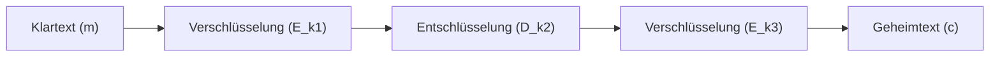

#Note

2026-06-22

Tags: [[IT-Sicherheit]], [[Kryptographie]], [[Symmetrische-Kryptographie]]
#it_security

---

### Sicherheitsanalyse und Schwächen von DES

Obwohl das mathematische Design von DES (insbesondere die nichtlinearen S-Boxen) extrem robust war, gilt das Verfahren heute als vollständig gebrochen.

---

#### 1. Die Schwachstellen von DES

##### A. Kurze Schlüssellänge (56 Bit)
* Die größte Schwachstelle von DES. Ein Schlüsselraum von $2^{56}$ ($\approx 7,2 \cdot 10^{16}$) Möglichkeiten kann heute durch Brute-Force in extrem kurzer Zeit (Minuten) durchsucht werden.
* Spezielle Hardware wie *COPACOBANA* (auf FPGA-Basis) kann DES-Schlüssel kostengünstig knacken.

##### B. Komplementär-Eigenschaft (Complementary Property)
* Gilt für jeden DES-Schlüssel: Wenn man Klartext $m$ und Schlüssel $k$ bitweise negiert (komplementiert, $\bar{m}$ und $\bar{k}$), ist auch das Ergebnis der Geheimtext bitweise negiert:
  $$E_k(m) = c \implies E_{\bar{k}}(\bar{m}) = \bar{c}$$
* **Folge**: Reduziert den Suchraum für einen Brute-Force-Angriff um die Hälfte (auf $2^{55}$ Schlüssel), da man bei jedem Test zwei Schlüssel gleichzeitig prüft.

##### C. Schwache Schlüssel (Weak Keys)
* Es existieren 4 *schwache Schlüssel* (bei denen die Verschlüsselung identisch mit der Entschlüsselung ist: $E_k(E_k(m)) = m$) und 12 *halbschwache Schlüssel*. Sie müssen bei der Schlüsselgenerierung ausgeschlossen werden.

---

#### 2. Triple-DES (3DES)
Um die Lebensdauer von DES zu verlängern, wurde **3DES** entwickelt. Da die S-Boxen an sich stark waren, verarbeitete man Daten einfach mehrfach mit unterschiedlichen Schlüsseln.

##### Der EDE-Modus (Encrypt-Decrypt-Encrypt)
* **Verschlüsselungsformel**:
  $$c = E_{k_3}(D_{k_2}(E_{k_1}(m)))$$
* **Entschlüsselungsformel**:
  $$m = D_{k_1}(E_{k_2}(D_{k_3}(c)))$$



##### Warum EDE (Verschlüsseln-Entschlüsseln-Verschlüsseln)?
* **Abwärtskompatibilität**: Wenn man alle drei Schlüssel identisch wählt ($k_1 = k_2 = k_3$), heben sich die ersten beiden Operationen auf:
  $$D_{k_1}(E_{k_1}(m)) = m \implies c = E_{k_1}(m)$$
  Dadurch verhält sich 3DES exakt wie Single-DES.

##### Schlüsselszenarien und Sicherheit
* **3-Key 3DES (168 Bit Key)**: Drei unterschiedliche Schlüssel. Die effektive Sicherheit beträgt jedoch nur **112 Bit** aufgrund von *Meet-in-the-Middle-Angriffen*.
* **Status**: 3DES ist heute veraltet. Es ist in Software extrem langsam (da DES dreimal durchlaufen wird) und anfällig für Kollisionsangriffe (z. B. *Sweet32*) aufgrund der kleinen Blockgröße von 64 Bit.

---
#### Flashcards

Warum führt die Komplementär-Eigenschaft von DES zu einer Schwächung?::Sie halbiert den Suchraum für Brute-Force-Angriffe von $2^{56}$ auf $2^{55}$ Schlüssel, da man durch das Testen eines Schlüssels immer auch dessen Komplement mitprüft.

Wie funktioniert die Verschlüsselung bei 3DES im EDE-Modus?::Klartext wird mit $k_1$ verschlüsselt, mit $k_2$ entschlüsselt und mit $k_3$ wieder verschlüsselt: $c = E_{k_3}(D_{k_2}(E_{k_1}(m)))$.

Warum bietet 3-Key-3DES mit 168 Bit Schlüssellänge nur 112 Bit effektive Sicherheit?::Wegen des Meet-in-the-Middle-Angriffs, der den Suchaufwand mathematisch drastisch reduziert.

---
### Verwendung
```dataview
TABLE file.mtime AS "Bearbeitet"
FROM [[Sicherheitsanalyse und Schwächen von DES]]
SORT file.mtime DESC
```
